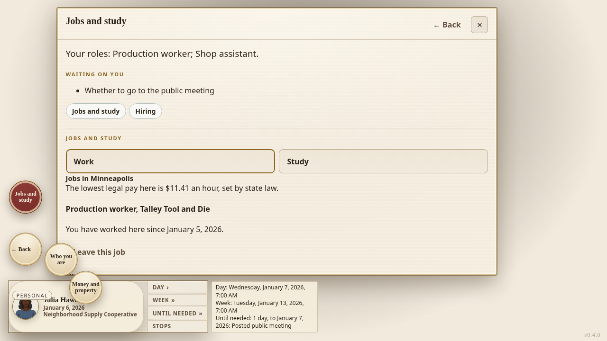
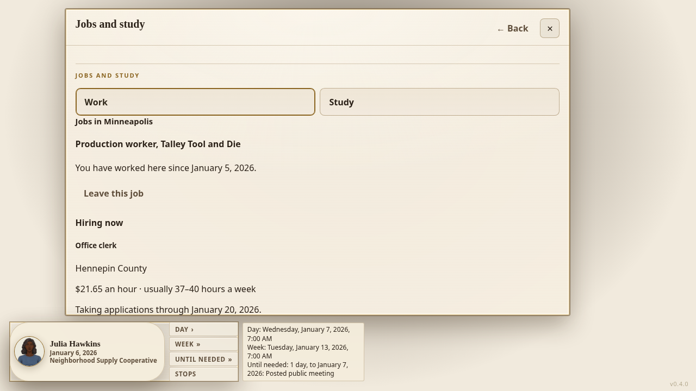

# Your Money — owner playtest Jobs items 7, 9 and 11

## MERGED

Not merged. Source and test checkpoint b8c663d1d4d727a15f1716f85dc32ebe913695ad is based on main d2e5727c198a083562169c1a7f6e52aec4fbc16a. Final publication adds only this receipt and the explicitly requested before/after screenshots. A41/A50 branches and inherited private configuration remain preserved.

## WHAT EMERGED

HARDWIRED: Jobs and study omits its role, waiting-list and jump-button introduction while the office and campaign screens retain theirs. Work and Study now start the content. HARDWIRED: town listings no longer render the legal-pay sentence or national median paragraph. HARDWIRED: Other work and new authored personal-work offer cards are no longer mounted. Existing work, completed shifts, obligations, study, offers and payments are not deleted or rewritten. Audit owns the separate creator/production retirement decision; this UI change does not claim it.

## VITAL STATISTICS

Builder-only changed-file receipt: PanelTimeControls.test.tsx and jobs-pay-floor-panel.test.tsx, 15/15 passed in 30.89 seconds. Complete changed saved-pay-stub browser file, 1/1 passed in 38.1 seconds with original paycheck assertions, stock limits and native source-identity checks. Before capture on main d2e5727c1 plus screenshot-only test blob e08c5661f31da1c1a35ad82074bb5211f8de4d24 passed 1/1 in 46.9 seconds. Startup errors before that successful run remain preserved. Installed tsx resolved the native setup import; the browser used installed Chromium and a dedicated port. All owned servers are stopped. Official Claude gate, scoped types and final-main acceptance remain NOT RUN here.

Before: 

After: 

These show the same saved fixture life, not the owner's unavailable January 21 save. Its legacy authored shop engagement is retained on the save; no real-employer replacement is inferred.

## 1. Why-chain to bedrock

Why did the owner have to scroll before reaching jobs? The shared Work layout repeated role, pending work and jump buttons before the Jobs panel. Why was a second work catalog offered? LifePathsPanel mounted CareerPathsPanel and personal work definitions alongside actual town listings. Why remove only their UI here? Existing saved work has earned obligations, and silently erasing them would lose facts. Bedrock: the approved town-opening pipeline supplies new jobs; saved obligations remain until an approved compatibility transition exists.

## 2. Research

No new wage or occupation data. Reuse existing actual town employer openings, applications and saved work. Item 8's sourced occupation description is a separately released O1 field delta; no fictional duties are transplanted here.

## 3. Revisions

Limit introduction removal to the Jobs section. Preserve office/campaign introductions, existing classes, Study, hiring, applications, held-job controls, the clock and all simulation producers/readers.

## 4. What gets built

Replaces: the duplicate Jobs introduction and separate authored-work browsing mount with existing Work/Study and town listings. Deletes: their display mounts, the legal-pay display and median display. New production exports: none. No financial or employment records are deleted.

## 5. Simulated, records, world pieces, checks

SIMULATED: no new decision. RECORDS: existing work and money remain. WORLD PIECES: the unchanged job market and study systems. CHECKS: read-only panel removal before/after an enacted raise; saved old offer does not restore the separate catalog; actual browser navigation retains Work/Study and ordinary payday behavior.

## 6. Proof run

The changed browser file loads its recorded shift fixture, opens Jobs through the shell, verifies the removed top row/catalog/sentence, captures the screen, closes it and advances one day through the existing clock. It then preserves the original saved-paycheck assertions. This is the current UI composition, not all-56 natural hiring or complete job-system retirement.

## 7. Worked example

The screenshot life is Julia Hawkins in Minneapolis. The retained saved job reads Production worker at Tally Tool and Die, held since January 5, 2026. The town listing reads Office clerk at Hennepin County with its saved pay and hours. The new UI does not create either record. It removes the repeated introduction and legal-pay narration so the actual listing appears earlier.
