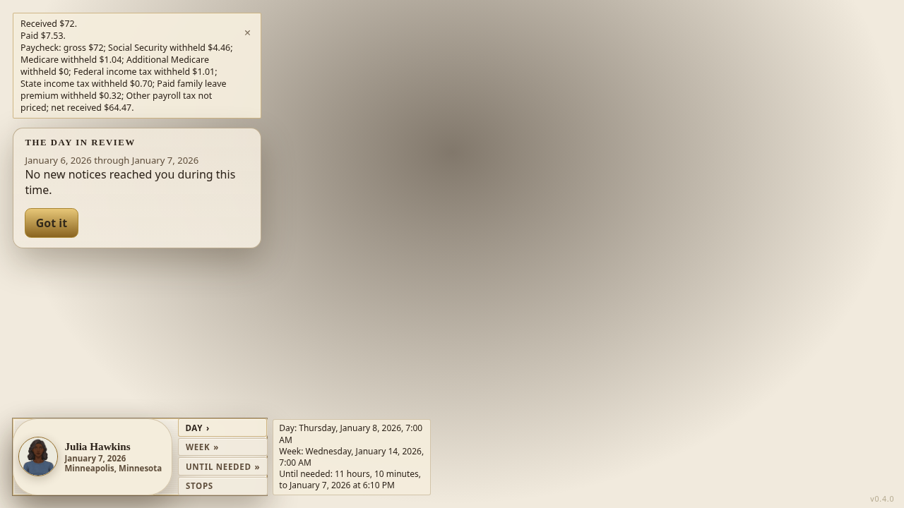
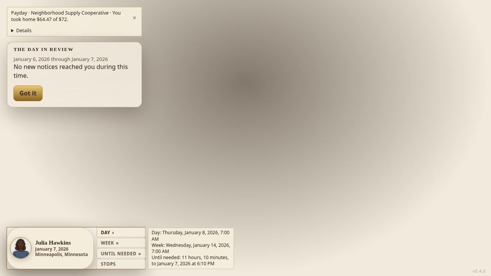

# Your Money — owner playtest item 12: payday notification

## MERGED

This payday change is not merged. Jobs parent #1825 is verified merged at 29aa0e3618a456e13a89427534be2ce6c1403d4c. Final browser-tested production source is 56eabd2920aa5d3c08ac676ba4c7827d192d8c44; final publication adds only this receipt and the requested screenshots. Other source branches and the inherited private configuration remain preserved.

## WHAT EMERGED

HARDWIRED: newly saved pay displays its actual dated employer, actual paid gross and take-home amount in a small notification. Native Details exposes positive recorded withholding and any recorded partial-payment or missing-assessment explanation. HARDWIRED: the routine outcome excludes the exact paycheck and saved withholding transfers already represented by this notice. Existing money, taxes, clocks and unrelated outcome prose remain unchanged. No CSS or simulation producer change.

## VITAL STATISTICS

Builder receipts, not official Claude gates: at ccd0b91e8f1653e57c2e93ef88b1a5f7e5f5683d the complete changed saved-pay-stub.test.ts passed all five cases. Together with the complete changed next24-routine-route.test.ts, result was 10 PASS / 2 FAIL in 40.60 seconds. Both failures occur before the new notification assertion: the kept mid-shift and full 09–13 Attend routes expect minute 1185 but produce 1110. Original next24 test blob 44a3d316542b214d6c61e24148ca2843ca41002e on plain PR-main base d2e5727c198a083562169c1a7f6e52aec4fbc16a produced the identical two failing names/assertions, 5 PASS / 2 FAIL in 20.63 seconds. These inherited clock failures remain failures and are routed to Audit.

The first browser run reached the actual headline and Details, then failed because a negative-text assertion required a generic outcome element that was correctly absent. Replacing that check with explicit element absence preserved all monetary and disclosure assertions. Complete changed browser file passed 1/1 in 39.7 seconds at b7535fd12ee64900d527574b0f4a5b22de24ab3f. After grouping headline and Details in one existing HUD content container, the unchanged browser test blob 991f4d6c31ac810a48304b075eac372df55c60f4 passed 1/1 in 38.5 seconds at final source 56eabd2920aa5d3c08ac676ba4c7827d192d8c44. Stock limits and native source identity were retained. All owned processes are terminal.

Final native rerun, scoped types, lint/format gates and official Claude gate are NOT RUN here. Projection/native source did not change after the named native receipt. Audit exclusively owns the newer cross-cutting JSON-import collection failure; no blocked browser run was repeated after that dispatch. Merge owns the separate NEW PaydayNotification.test.tsx draft; no unreceived/unexecuted draft is claimed as proof.

Before: 

After: 

Details: 

These are actual browser captures of a retained legacy authored saved engagement, not the owner's unavailable save or a natural town-employer hire. Removing new fictional offers in #1825 does not erase that saved obligation.

## 1. Why-chain to bedrock

Why was payday hard to read? Routine prose mixed the paycheck with other money events and showed unknown or zero tax lines. Why use saved pay records? Only the actual payment, assessment and withholding records establish what was paid and withheld. Why keep computation in the existing reader? A second gross/net calculation could disagree with the ledger. Bedrock: recordedPayStubs joins actual transfer, liability and payment records; this change only presents that result.

## 2. Research

No new wage, tax, employer or occupation data. Reuse recordedPayStubs, moneyText and organizationProfileAt at the paycheck date and sequence. Missing employer evidence stays absent; a later rename cannot rewrite an earlier paycheck.

## 3. Revisions

Separate payday from generic routine prose; native Details starts closed; show positive saved withholding only. Preserve unknown assessment and partial payment explicitly. Reuse existing HUD classes and dismiss behavior; do not restyle.

## 4. What gets built

Replaces: the old routine Paycheck gross/tax/net block and duplicate generic aggregation for the exact represented transfers. New exports: paydayNotifications, PaydayNotice, PayDayNotices and PaydayNotification. The world observer reads each new saved paycheck once across shell actions; it never creates or settles money. No financial writer is deleted or duplicated.

## 5. Simulated, records, world pieces, checks

SIMULATED: no new decision. RECORDS: unchanged pay outcomes, tax liabilities, actual withholding payments and dated employer profiles. WORLD PIECES: unchanged payroll and tax settlement. CHECKS: seeded five-place actual pay, partial and unknown-assessment controls, employer rename cutoff, repeat/reopening, unchanged serialization, real browser Details and dismissal. Clock failures remain explicit.

## 6. Proof run

Load the saved browser fixture; open Jobs and verify Work/Study; close Jobs; advance one day through the shell. Read the actual new payday notification, open Details, verify saved federal/state withholding, verify the duplicate routine notice is absent, capture screenshots and dismiss. The native cases independently retain actual pay, taxes, employer cash and reopening assertions. This is item 12 proof, not complete Your Money end-to-end acceptance.

## 7. Worked example

The retained browser obligation pays $72 gross from Neighborhood Supply Cooperative, with recorded $1.01 federal and $0.70 state withholding plus the existing payroll deductions. The saved reader reports $64.47 take-home. The notification displays that actual result; Details shows the positive withholding records. None of these fixture values is used as a game default.
