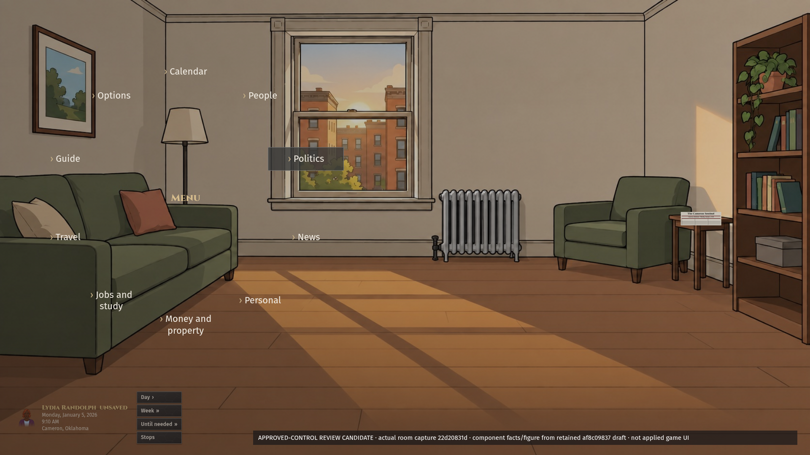
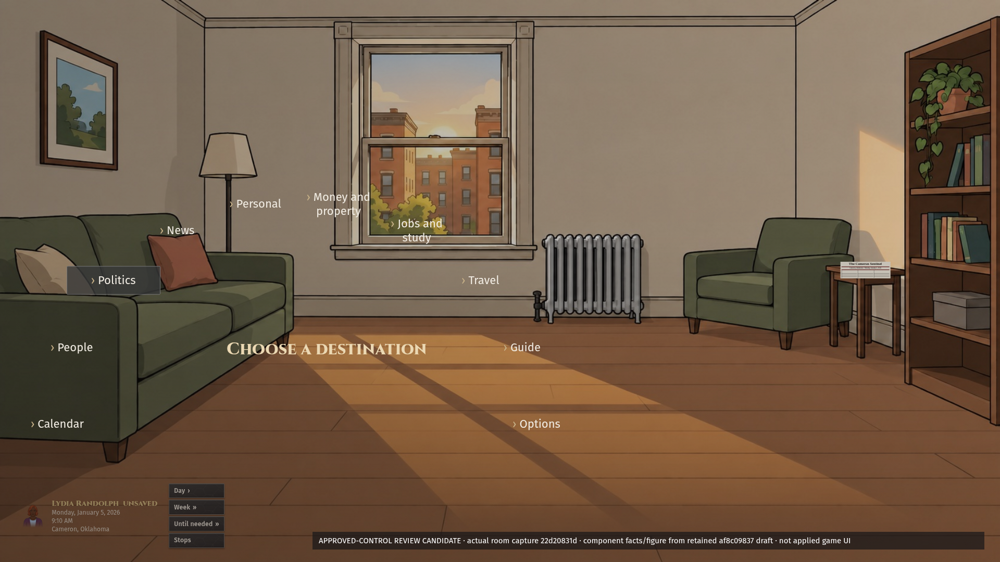
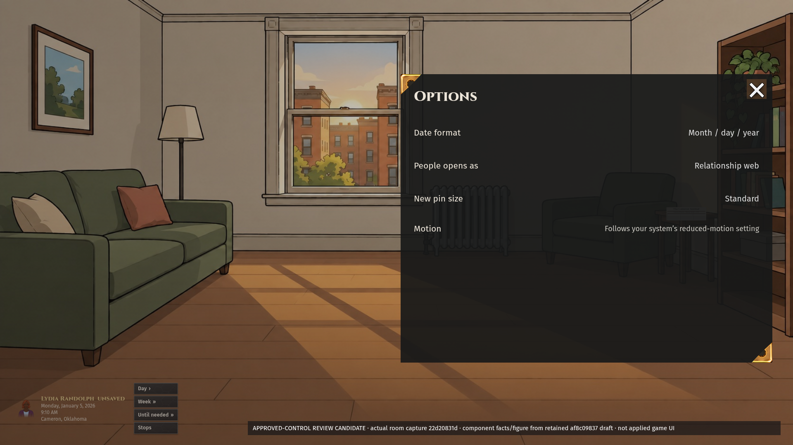
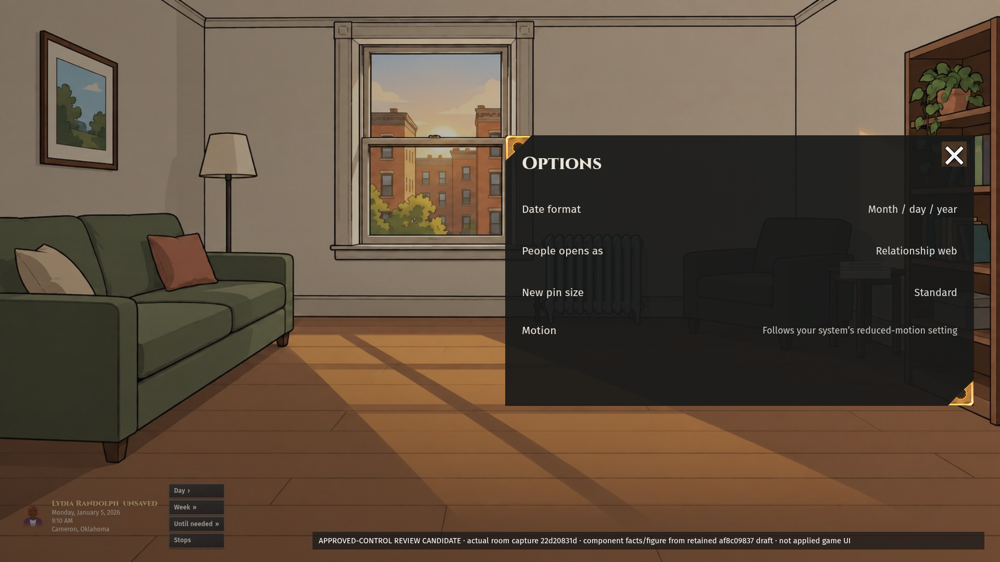
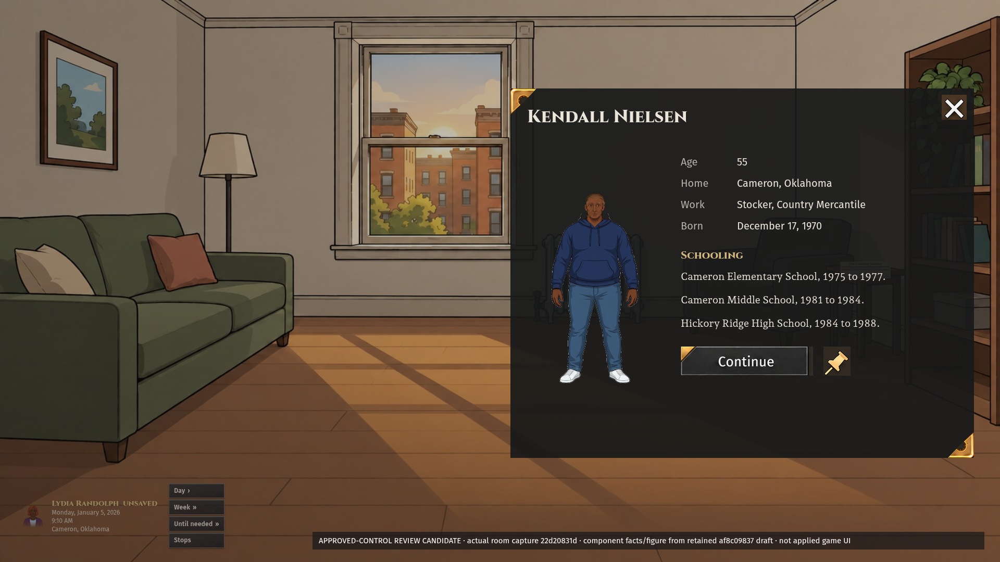
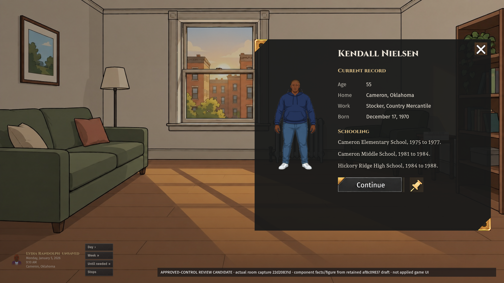
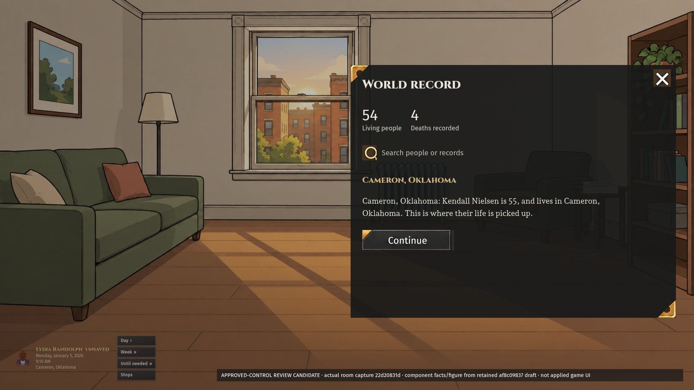
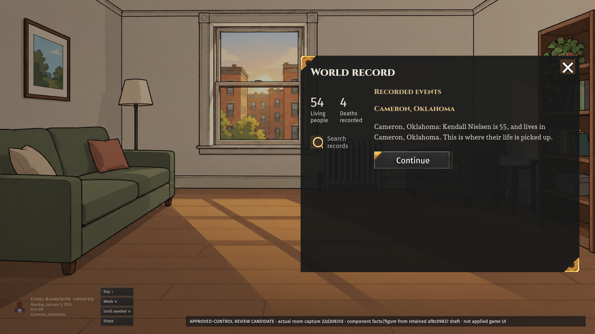

# Session 14 — current Kit 13 review candidates

[Latest radial: one direction, three states](radial-three/README.md). Person and World candidates preserved pending owner pick; Options held.

[Latest verdict-2 review page](verdict-2/README.md). Earlier candidates below remain preserved.

Eight static candidates using the verified approved sheet's control artwork and Cinzel titles, Fira Sans controls, Andada Pro narrative. Earlier #2228 images remain intact under `docs/mockups/oct5-menus/`. These menu layouts are not owner-approved; no production source changed.

## Radial

| A                         | B                         |
| ------------------------- | ------------------------- |
|  |  |

## Options

| A                           | B                           |
| --------------------------- | --------------------------- |
|  |  |

## Person

| A                         | B                         |
| ------------------------- | ------------------------- |
|  |  |

## World

| A                       | B                       |
| ----------------------- | ----------------------- |
|  |  |

## Reference, source and fit receipt

- Binding controls: main `6048b1331b9f1be7948b8827db75dcc4d6b5c1f4`, `docs/ui/kit13/APPROVED-2026-10-04.md` and `approved-controls-2026-10-04.png`. The PNG is 1,509,746 bytes, SHA-256 `347c8e90d953229458e5eef34b497f4b109c09c3cc1ba5d79a7ba3f676f0f4c0`; exact original visually inspected.
- Control artwork is displayed directly from that exact sheet with CSS sprite windows, not reconstructed icons. Continue, close, pin, search and panel-corner artwork retain the original pixels. Corner windows isolate ornaments without a continuous binding. Sheet-background remnants around sprite windows remain a compositing limit; these are not production-ready extracted assets or pixel approval. No new controls were authored.
- Options uses approved plain-text dropdown resting presentation; radial list items retain chevrons and a selected glass state. No scrollbar, day circle, section gold rules, binding or stacked HTML cards. Gold/brass progress and brass slider are binding but absent because these particular screens do not need them.
- Actual game image beneath the proposal: clean main `22d20831d9569c2c133371b3d1db77fb06a55f01`, ordinary creator → first room, Cameron, Oklahoma, generated Lydia Randolph, age 55. Chromium at 1920×1080, isolated port 4194 and fresh browser context. The unmodified capture remains at `docs/mockups/oct5-menus/revision-1/actual-room-main-22d20831d.png`. No World injection or forced scene. Ordinary generated game seed was not exported, so exact replay identity is incomplete.
- Kendall Nielsen figure/facts and sparse World record retain the original independently generated draft at `af8c09837`; they are separate proposed component content, not claims about Lydia's World or the room's actual attendees. Existing engine art/source lineage is preserved.
- [Fit receipt](fit.json): all eight have zero page overflow at 1920×1080; all six panel variants have zero internal overflow. This measures sparse static content only. Dense records, responsive sizes, runtime interactions and saved behavior are not proven. The actual player card is preserved beneath the overlay and remains Session 3's redesign ownership.
- References inspected: Crusader Kings III official character/dynasty screenshot `6ebda65d` and map selection screenshot `8776b7e4`, https://store.steampowered.com/app/1158310/Crusader_Kings_III/. Compact identity/fact presentation and adjacent detail informed the person/record direction. Options/radial/dense-record-specific reference study remains open; no borrowed proprietary assets included.
- Organizer/podium consumer proof and shared final menu/layout selection remain open. Map proposals are separate from this eight-image handoff. No art approval, runtime correctness, READY or implementation approval is claimed.
