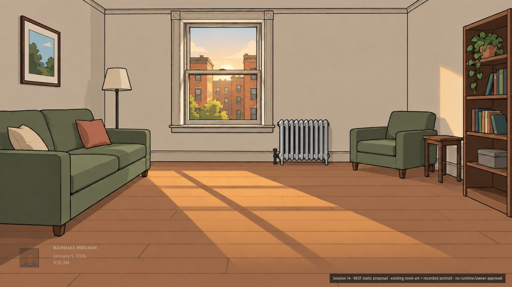

# Session 14 — one portrait radial, three states

Requested by CTO 6007119647. One direction only. Static 1920×1080 review images; no implementation, owner pick or visual acceptance. Previous candidates remain unchanged.

| Rest                     | Approach                         | Open                     |
| ------------------------ | -------------------------------- | ------------------------ |
|  |  |  |

Portrait itself grows 72 → 108 → 140 pixels around a fixed bottom-left center; opacity .45 → .72 → .98. The local navigation fan is hidden at rest, grows/gets more opaque on approach, and opens around the portrait. Clock remains beside it. There is no Menu box or opaque bar covering old Day/Week controls. Seven names come from existing shell groups: Calendar, People, Politics, News, Personal, Travel, Guide and options. No new destinations or grouped-navigation approval claimed.

## Provenance and limits

- Room stage: existing released `art/backdrops/small-apartment__morning.jpg`. Art-backed layout proposals, not runtime screenshots. Previous actual capture/replay timeout receipts stay separate, not relabeled.
- Recorded portrait: canonical engine composite for Kendall Nielsen from ordinary full opening at source `6048b1331`, seed `session14-real-art-mockups-20261005`, independently drawn Cameron, Oklahoma. Recipe/parts and record provenance: preceding `verdict-2/record-receipt.json`. No new figure, invented history or events.
- Approved fonts: Cinzel name, Fira Sans controls/clock; Andada Pro narrative family, with no narrative block here. Verified original Kit 13 sheet supplies iron frame edge as a nine-slice derivative. Text triggers/list-item chevrons and selected glass state use the binding pattern. Pixel-perfect extraction is not claimed.
- [Fit receipt](fit.json): zero page overflow at 1920×1080 in all three. Records portrait size/opacity, fan opacity and each label rectangle. No internal scrolling. Static composition only, not proximity/animation/click/touch/keyboard or smaller-viewport runtime proof.
- Existing CK3 character/dynasty reference study informed the portrait anchor; direct component reference is the recovered Kit 13 original. Specific real-game radial study remains open.
- Thin light X and person action wording **Full history** are recorded required corrections for preserved person/World candidates. Those images are not overwritten while owner selection is pending. Options review held until radial accepted.
- Full player card remains Session 3-owned; this is the narrow portrait/clock/navigation seam. No production source changed.
