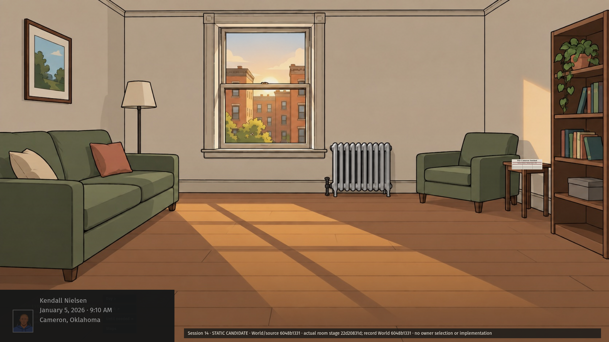
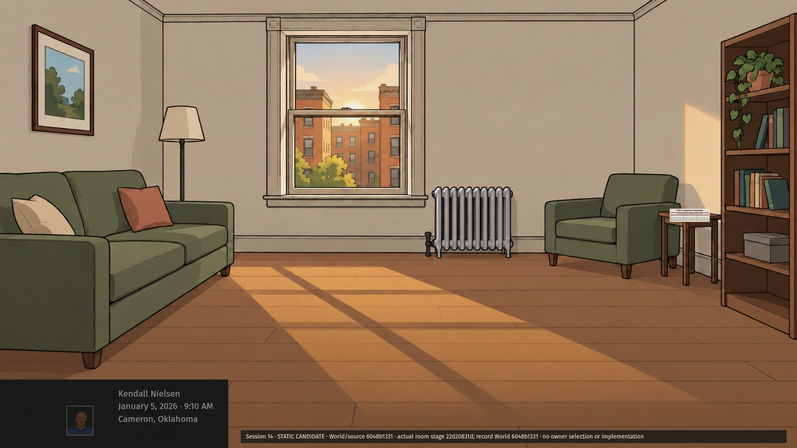
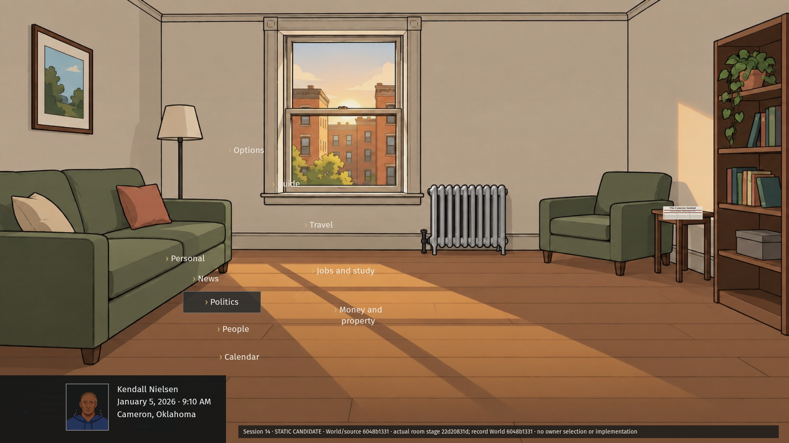
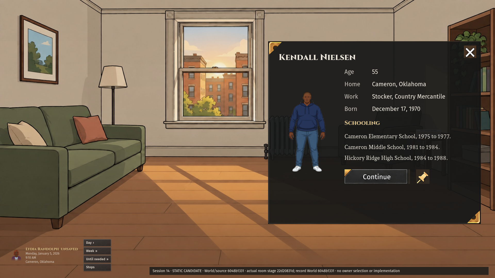
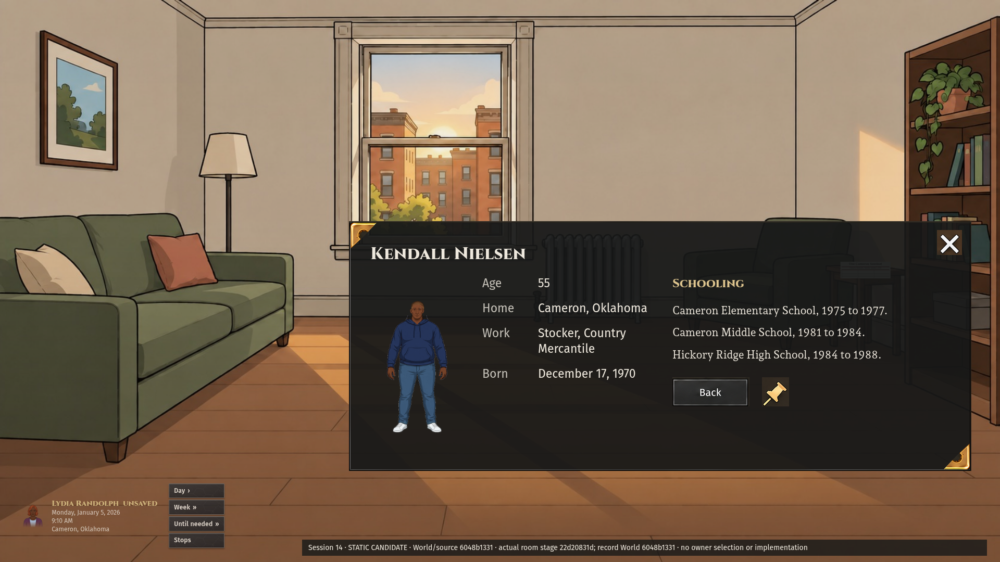
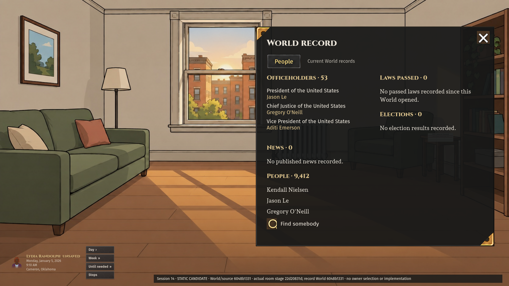
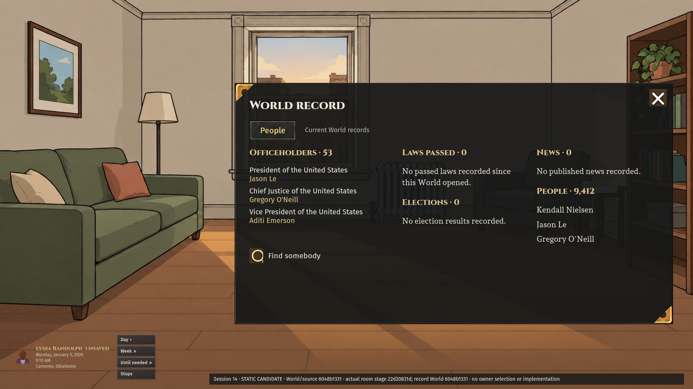
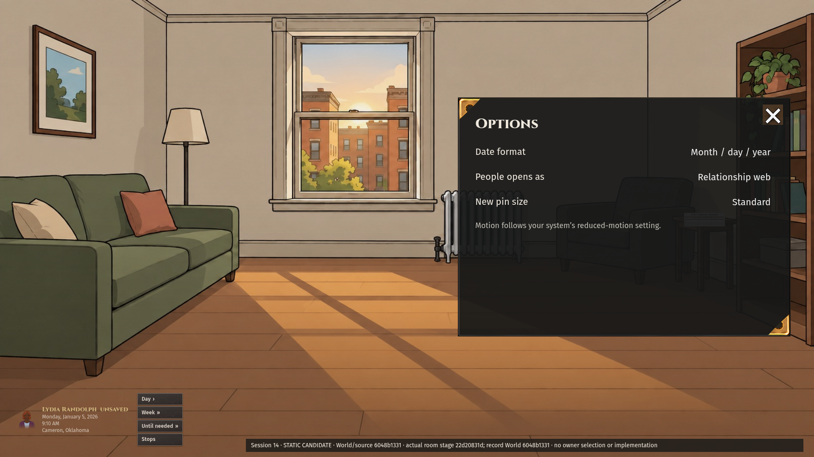
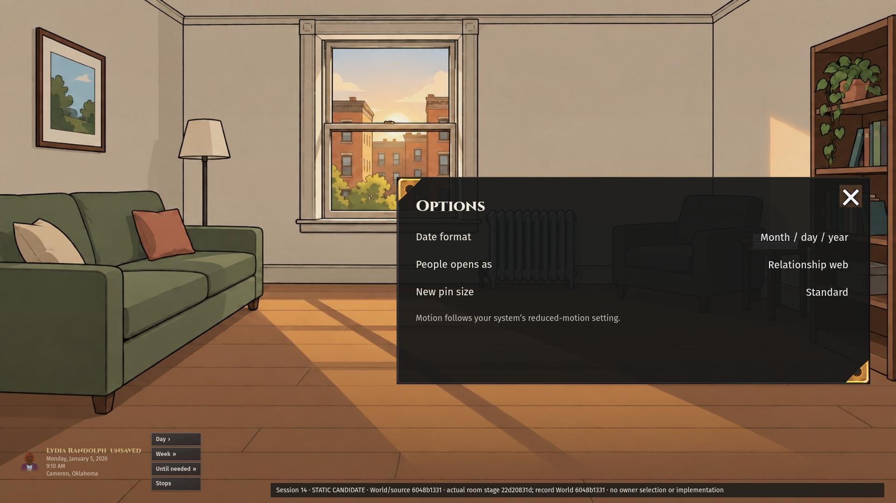

# Session 14 — verdict 2 candidates

Responds to CTO 6006905036. Two directions at 1920×1080: A is a taller side presentation / rising portrait fan; B is a shorter wider presentation / shallow portrait fan. All older candidates are preserved. Nothing selected, implemented or art-approved.

## Portrait radial

| A rest                       | A open                  |
| ---------------------------- | ----------------------- |
|  |  |

| B rest                       | B open                  |
| ---------------------------- | ----------------------- |
|  |  |

Portrait grows from translucent rest to open, clock adjacent; no Menu box or day circle. The bottom-left mask covers the captured legacy player controls; it is a bounded composition placeholder, not approval or implementation of Session 3's complete player card.

## Person

| A                         | B                         |
| ------------------------- | ------------------------- |
|  |  |

## World

| A                       | B                       |
| ----------------------- | ----------------------- |
|  |  |

## Options

| A                           | B                           |
| --------------------------- | --------------------------- |
|  |  |

## Source and limits

- [Actual record receipt](record-receipt.json): full ordinary opening generated through existing `generateOpeningLife` / `prepareOpeningLife` on clean main `6048b1331b9f1be7948b8827db75dcc4d6b5c1f4`; seed `session14-real-art-mockups-20261005`, independently drawn Cameron, Oklahoma, age 55. No advance, authored outcomes, seed search or events injected. Person, education and work come from canonical readers; figure from the existing people-art engine and its recorded recipe.
- World has 9,412 living people, 53 projected officeholders, zero enacted laws, zero recorded election results and zero published news at its opening. The five sections show these facts, including explicit empty sections. Three actual named officeholders preview 53 records; displayed people are actual named records, not an invented population roster. Populated laws/election/news density is not proven.
- Approved component reference: main Kit 13 original PNG, exact SHA-256 `347c8e90d953229458e5eef34b497f4b109c09c3cc1ba5d79a7ba3f676f0f4c0`, 1,509,746 bytes. Cinzel titles / Fira Sans controls / Andada Pro narrative. Direct sheet sprites for brass ornaments, iron control frame, Continue/Back, Pin, Search, selected People tab and close. Panel border uses the approved Back-frame edge as a nine-slice derivative, not a newly drawn frame. Sprite context remnants remain a compositing limitation; no new production art or pixel approval.
- [Fit receipt](fit.json): eight open variants have zero page and internal panel overflow at 1920×1080. Sparse static content only; not responsive, dense-record, interactive or saved-behavior proof. Radial rest screenshots are additionally provided; rest/open transition behavior has not been implemented.
- Actual game room stage is the preserved ordinary creator screenshot from clean main `22d20831d`, generated Lydia Randolph in Cameron. The current Kendall record World is separate. A matching current replay screenshot was attempted but timed out after 120 seconds; [failure retained](replay-failure.txt). These are actual-room-art composition proposals, not matching-World room/attendee proof. Source screenshot remains under the earlier revision's provenance path.
- Real-game references inspected: CK3 official character/dynasty screenshot `6ebda65d` (portrait/facts/related records) and map selection screenshot `8776b7e4` (adjacent information). https://store.steampowered.com/app/1158310/Crusader_Kings_III/. No proprietary reference imagery included. Radial/settings-specific study remains a limit.
- Options shows existing date format, People default and new-pin size plus the reduced-motion note; plain-text resting dropdowns. Chat/button-grid redesign is excluded. Organizer/podium scaling cannot be established with this apartment stage. Map remains a separate proposal.

Owner layout selection remains required before code. No READY or approval claimed.
