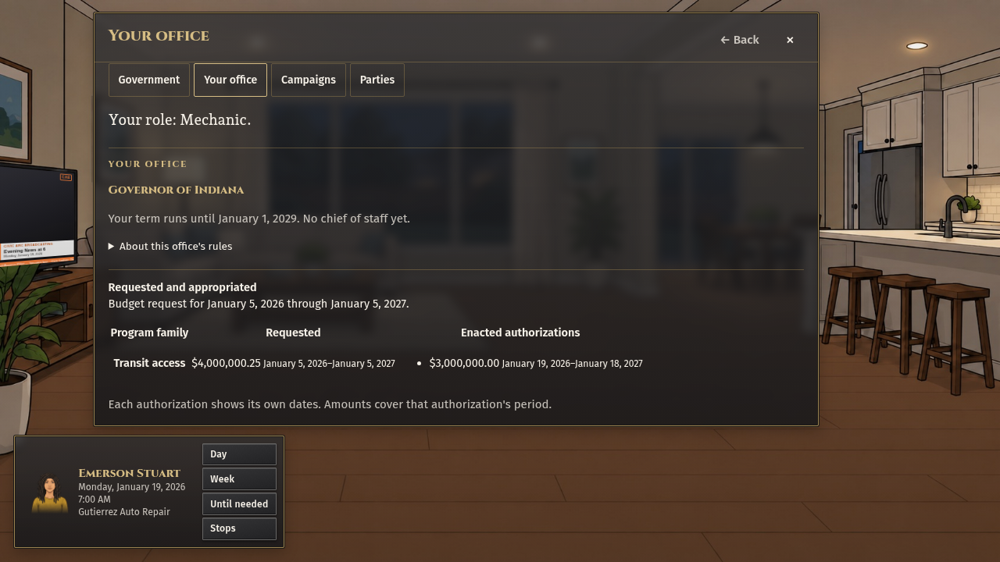

# Session 23 dollar budget desk evidence

The budget desk shows $4,000,000.25 requested and $3,000,000.00 authorized for
transit access. The new capture and saved record comparison passed after reload.
Preparing the request remains optional and creates no spending authority.

## Current main composition

The new ordinary-life proof passed at `83cc2f3bd437aece3368cf129370885fdac0ae06`,
which preserves main `e591ffc637d1f6db84d2ff920e8662ce123202ed`. One browser test
passed in 8.6 minutes, including final saved-record equality. The expected and
served source identities match. See [browser receipt](main-browser-checks.json)
and [actual saved record lines](main-record-lines.json).

The final composition `d7ef7cc2f61a191a2c94e874eb9b682d49bc4fa7` adds actual
main's shared gate repair `68c8a66307085d38c5db741ce46be9141cff3e18`. Its runtime,
browser and configuration files match the passing proof; the only source-tree
difference is two owner-supplied press fixture defaults. Configured typecheck,
changed-file lint and formatting, release range and zero-dice pass. See the
[final main-gate receipt](final-main-gate-checks.json).

Terre Haute, Indiana, place 1875428; seed
`session23-part4-dollar-budget-new-game-2026-10-06`. Emerson Stuart is the
original generated player, with an explicitly authored governor tenure. The bill
uses supplied votes through canonical writers and honors the fourteen-day reading
interval. This proves the controlled desk, not a natural election or NPC bargain.
The earlier unchanged main press fixture type errors are separately reproduced in
[composition checks](main-composition-checks.json). The earlier new-main run
stopped at the added Difficulty screen; its original trace and compact timings
remain in [creator navigation failure](creator-navigation-failure.json).

## Historical capture

New ordinary life: Emerson Stuart, age 40, Terre Haute, Indiana, place 1875428.
Seed: `session23-part4-dollar-budget-new-game-2026-10-06`.
The original generated person receives an explicitly authored governor tenure;
the fixture preserves her private life and the office's original term end.
The comparison bill uses supplied legislative votes through existing writers.
This does not prove a natural election win, NPC bargaining or program payments.

The image and [record lines](record-lines.json) were captured at source head
`a9216a753458699934e25d0d8bf745747fe36c3f`. That run passed both displayed-amount
assertions and extracted these actual saved records, then failed before final
reload equality when Chromium refused eager art imports with
`ERR_INSUFFICIENT_RESOURCES`. Its trace remains untouched under
`test-results/runs/session23-p4-budget-authored-seat-2`; SHA-256:
`3fbbf277b91562670ae80a6d99b5122929d8646c42ccc043b80c13279b9a0900`.

The PR description records the final rerun's exact head and result. This bundle
alone does not assert that the browser test passed. The proof now removes
redundant title navigations while retaining actual reloads, amount assertions
and saved-record equality.
