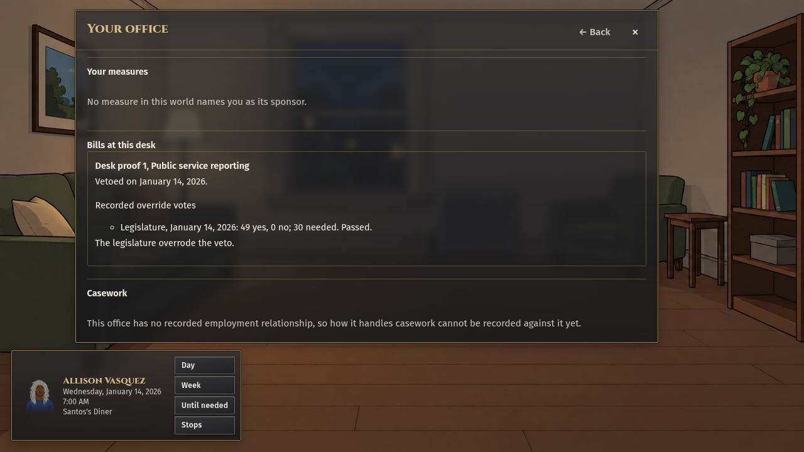
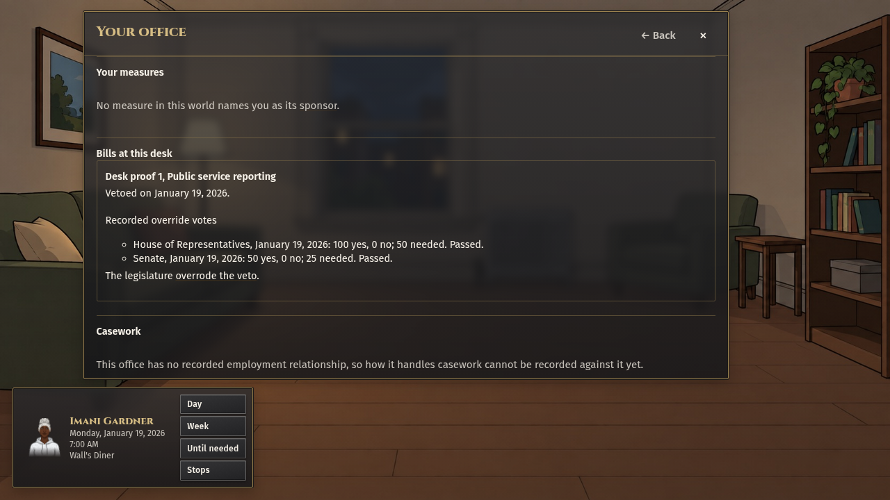

# Part 5: recorded executive veto and override results

Both routes passed, including saved-record equality and reloaded desk assertions, at clean source head `d516a3d67c36242d33b5bc9e03f3ca936331f1cc` over actual main `f88508186b78f526ecf89a420b5fb584171e039a`. Expected and served source digests match: `316e46b7b3292230d5192d507299f2589af43d5bdcd939c46da1c939a9eb7552`. The evidence bundle adds documentation and byte-identical captured images; it does not change the tested runtime or proof source.

`record-lines.json` contains the complete actual saved votes, member dispositions, executive actions, override outcomes, tenure, matter and decision IDs. `source-identity.json` retains the expected and served source identity. `check-receipts.json` records commands, exit codes, counts, timing, screenshot hashes, the retained Nevada refusal and material limits. The two images below are the captured bytes from that exact source head.

| New ordinary life                                                                                                  | Authored downstream office                                                                          | Actual recorded override                                                                                                                    |
| ------------------------------------------------------------------------------------------------------------------ | --------------------------------------------------------------------------------------------------- | ------------------------------------------------------------------------------------------------------------------------------------------- |
| Uehling, Nebraska, place `3149425`; Allison Vasquez, age 40; seed `session23-part5-veto-new-game-US-NE-2026-10-06` | Original player person `person_474a74db69199706`, tenure `event_733ebbe71458ffa9`, `us-ne-governor` | January 14, 2026: 49 yes, 0 no; canonical threshold 30; vote `legislative-vote_3020cc12a733c30f`                                            |
| Brookston, Indiana, place `1808146`; Imani Gardner, age 40; seed `session23-part5-veto-new-game-US-IN-2026-10-06`  | Original player person `person_84536f46b5abcf48`, tenure `event_f90d90bea8718c17`, `us-in-governor` | January 19, 2026: House 100 yes, Senate 50 yes; actual vote IDs `legislative-vote_7e6618a3ea557a14` and `legislative-vote_0ce73079e76188de` |

The ordinary creator generated each starting life. The fixture then recorded an explicitly authored governor tenure for that same original person, preserving identity, home, age and household. It supplied actual seated-member legislative dispositions through the existing procedure and override writers. Enrollment, presentment, the player's veto, the resulting votes and the saved outcome are real records. This proves the controlled downstream desk, rather than a natural filing/campaign/election journey, NPC bargaining or a payment outcome.

The routes use the existing ordinary clock and legislative reading intervals. No direct date assignment, shorter reading interval, larger timeout, extra funding or alternate treasury identity is used. The initial Nevada setup correctly refused its unscheduled 2026 regular session; the no-item-veto proof instead uses Indiana's annual session. Nebraska's item-veto grant is present; Indiana's is absent. The separate domain tests select a floor-added item before signature, verify its exclusion from enacted law, save/reload its actual IDs, and refuse stale, duplicate, foreign and unmatched choices without partial signatures.

The Indiana capture also preserves a source-rule issue: its existing compiled override rules record thresholds 50 and 25 for chambers of 100 and 50 elected members. The primary majority language appears to require 51 and 26. Exact IDs and the profile rounding seam were sent to Session 21 in board comment `6013178706`; this consumer does not rewrite the thresholds or hide the records. The unanimous outcome passes either interpretation. The initial-state model and this consumer's checks do not prove that every compiled legal threshold is correct.

Veto scene production is a separate handoff. `executiveBillSceneOffers` supplies typed actual facts and existing domain action arguments, with nullable recorded presence, actual term/matter/action/provision IDs and explicit unknowns. Session 4 retains the central scene, English, knowledge and foreground hooks. No new played veto scene is claimed by these desk screenshots or producer tests. Exact producer/action handoff: board comment `6012949967`, source head above.

Reproduction uses the normal `playwright.config.ts` and its source/evidence verification, with native Chromium at `/usr/bin/chromium`. The temporary config only resolves the repository paths absolutely, removes the unavailable browser channel and sets that executable. The exact config bytes are retained in `capture-config.txt`; adapt its repository root if necessary and copy it to `/tmp/session23-playwright.config.ts`. Run the command in `check-receipts.json`; `NODE_OPTIONS='--import=tsx'` is needed for that temporary config outside the package. The browser run passed two tests in 13.0 minutes. Seventeen focused tests, configured typecheck, explicit changed test/UI/fixture roots, changed-file lint/format, release check, zero-dice and diff checks passed.

`retained-natural-trace-timings.json` makes the earlier read-only natural-route diagnosis portable. Its original trace hash is `2d7d4b82ddcd0c150cb685c6bc56a8076b44c38022d6d5f22048bcca5a240dee`; original ZIP/log remain retained. The compact action and console rows were sent directly to Session 5 in `6009241161`. The 303512ms full route is not a February handler measurement, and the trace contains no individual handler-phase timing. This record is a retained failed natural-route receipt, distinct from both successful authored-seat desk routes here.

`prior-main-failure-receipts.json` preserves the relevant raw tails and exact main identities for the separate three-year heap failure and settled federal-save serialization failure. Neither is a current-main rerun, a candidate performance comparison, or proof of a completed NPC decision. They remain separate from the successful desk routes and are portable for their receiving owners; the original logs remain retained.
