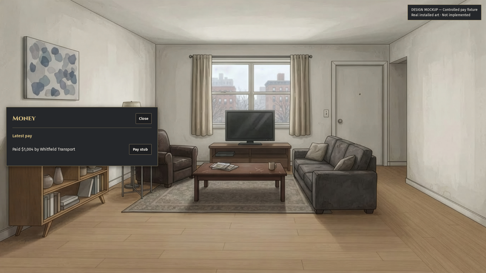
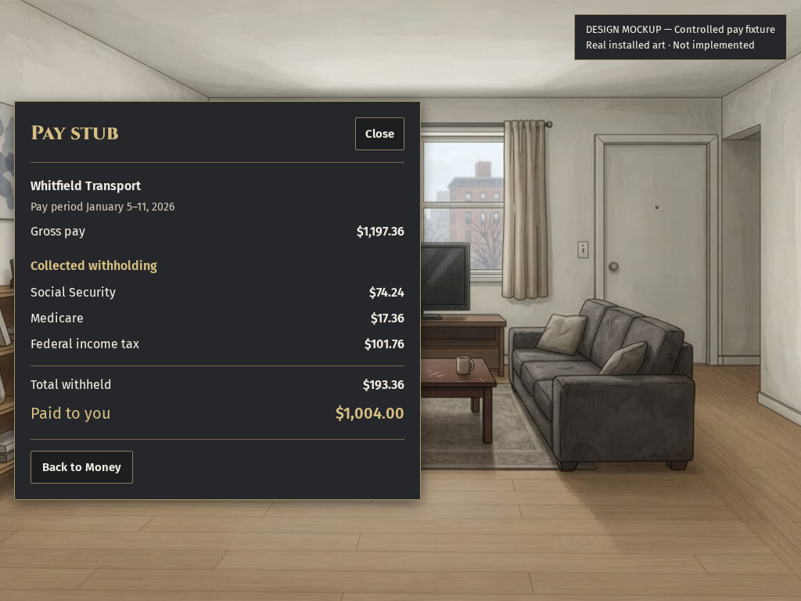
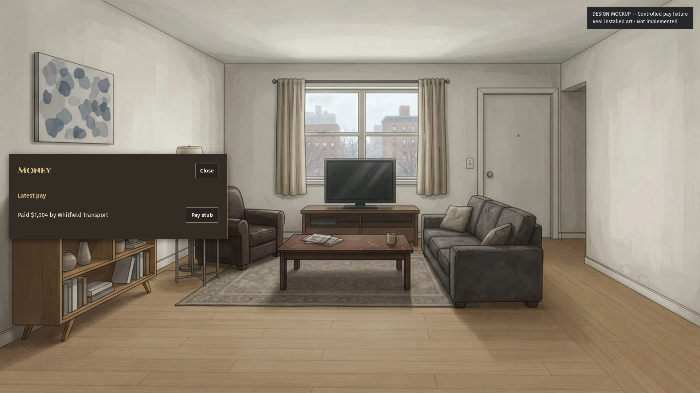
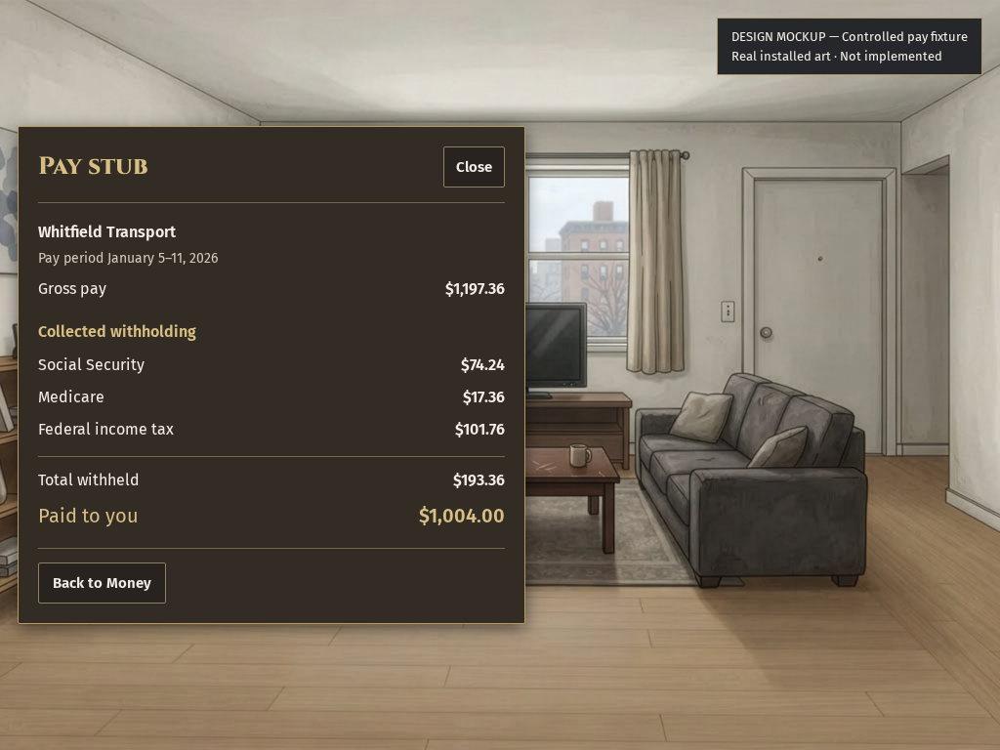

# Money shows the payment, with deductions on its pay stub

MERGED: None from this mockup. The owner must pick a treatment before implementation. Money shows “Paid $1,004 by Whitfield Transport” on one line. A separate pay stub shows collected deductions. Graphite is recommended to match the proposed player card. Both treatments fit one view with no internal scrolling. Production code is unchanged.

## WHAT EMERGED

HARDWIRED: These are static design proposals with a controlled payment fixture. They do not reproduce Kiara's playtest or report a naturally reached paycheck. The fixture uses the existing canonical transfer and paycheck-tax writers. The employer label and gross amount are explicitly authored for the owner's payment example; `fixture-script.txt` records this construction.

Measured: `controlled-pay-fixture.json` records gross pay of $1,197.36 and collected withholding of $193.36, leaving $1,004.00. Employee collections are Social Security $74.24, Medicare $17.36 and federal income tax $101.76. Employer liabilities are separate. Unknown local and employer rules remain unknown in the receipt; this mockup does not claim a complete tax assessment.

Measured: `fit-receipt.json` covers eight layouts: two treatments, two pages and two native viewports. Each has zero overflowing elements, zero clipped panel elements and no page scroll. At 1920 by 1080, the pay stub is 600 by 518 pixels. At 1024 by 768, it is 520 by 510 pixels. Its rectangle leaves 85% and 66% of the room area uncovered, respectively; these percentages exclude the design caption.

## References studied before this proposal

The official Steam gallery for Football Manager 2024 supplied two inspected references. Its Danny Welbeck player overview uses a compact identity header and aligned detail columns. Its “Hire an intermediary” screen uses a single detail table with aligned values. The pay stub borrows that compact table hierarchy, not its game actions.

- [Football Manager 2024: Danny Welbeck overview](https://shared.akamai.steamstatic.com/store_item_assets/steam/apps/2252570/ce6e4238dd12ec17f43ad48882f7a72f8e10cddf/ss_ce6e4238dd12ec17f43ad48882f7a72f8e10cddf.1920x1080.jpg?t=1763646323)
- [Football Manager 2024: Hire an intermediary](https://shared.akamai.steamstatic.com/store_item_assets/steam/apps/2252570/ss_c61172e8694630ce6a22c74aa826341c80975d8d.1920x1080.jpg?t=1763646323)
- [Crusader Kings III: character and family pane](https://shared.akamai.steamstatic.com/store_item_assets/steam/apps/1158310/76a6d0fea5a9676d4fa419c2ff44157d17ae9ef9/ss_76a6d0fea5a9676d4fa419c2ff44157d17ae9ef9.1920x1080.jpg?t=1790873953)

CK3's portrait-led identity and family pane also informs the player-card comparison. That reference study occurred after the original player-card capture and before this Money drawing. The Sims 4 gallery contained promotional art without its HUD; it was not used as panel evidence. Reference images are linked, not republished in the repository.

## Shared treatment and ownership

A uses opaque graphite `#25272a`; B uses opaque warm iron `#332c25`. Both use off-white `#f3eee5`, brass `#d7bf83`, Fira text, Cinzel headings, 2px corners and controls at least 42px tall. Hover lightens the surface and border. Keyboard focus uses a 2px brass outline. Selected, advancing, disabled and save-error production behavior is not implemented.

Session 3 owns this Money mockup and the bottom-left player card. Session 2 owns opening cards and the shared shell. Session 14 owns its confirmed menu and map lanes. Session 8 owns paycheck-toast removal and canonical payee correctness. No shared stylesheet, financial producer, chat interface or scene route changed. The owner pick required by CTO6006176111 remains open; this is design evidence only.

## VITAL STATISTICS

Measured: Eight screenshots and eight layout checks passed. Prototype pointer and keyboard navigation opened the pay stub, returned to Money and closed the panel. Those controls are static prototype handlers; no game payment or command was dispatched. Human inspection checked the small-view graphite pay stub. No world-speed job ran.

Method: The source baseline is the preserved screen head `772d1bfdc36d44e23bdc34e5e07082493888e026`. The controlled fixture uses the existing paycheck-tax consumer fixture, with its seed and record IDs preserved. The installed canonical apartment master is a placement reference, not the fixture person's recorded home. Its path and SHA-256 are in `fit-receipt.json`. This master was enlarged from the 1376-pixel original; no added art-detail claim is made. The prototype reads local installed fonts and art, with no production edits.
