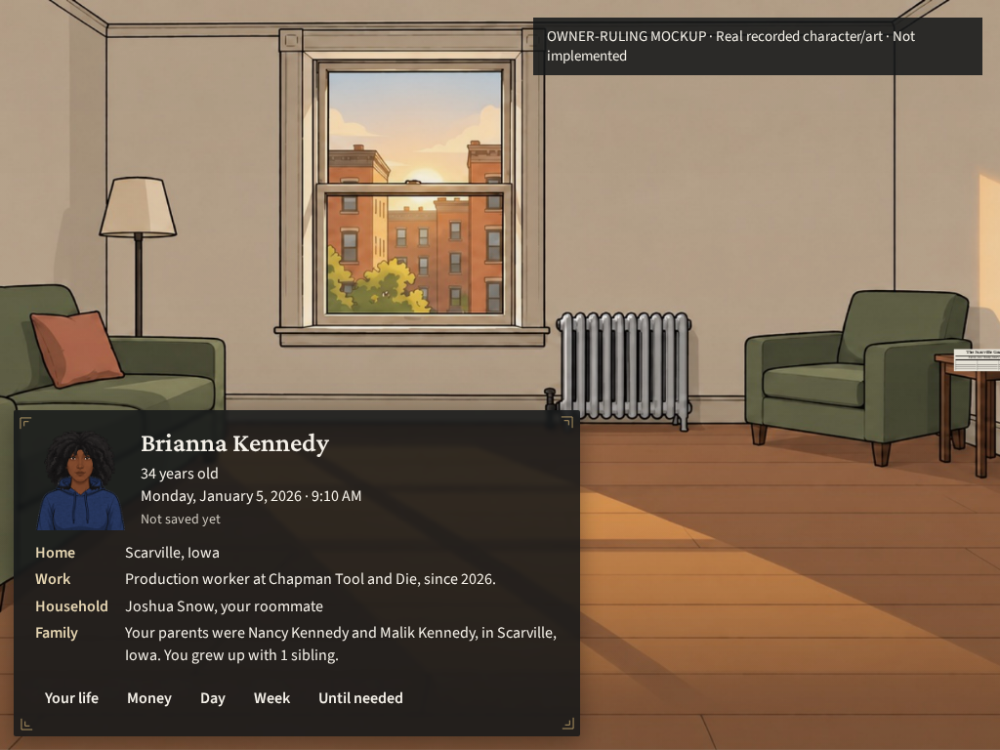
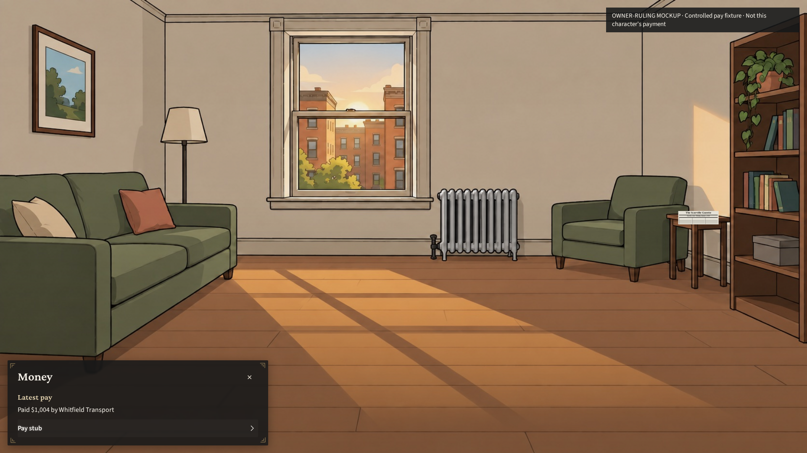
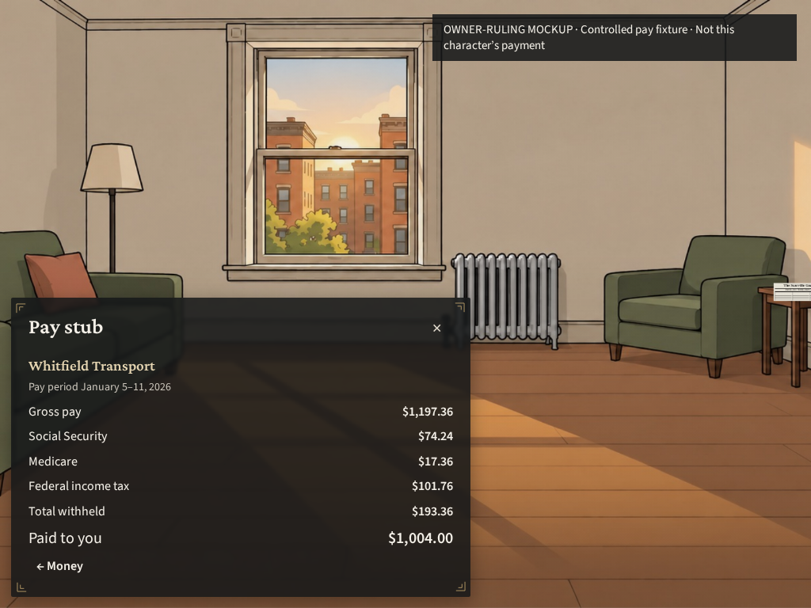

# The card and Money share the bottom-left UI

MERGED: None from these mockups. The owner's latest ruling replaces the earlier opaque treatments and fonts. The revised player card and Money occupy the same bottom-left surface, with dark translucency, corner ornaments and unboxed controls. The owner must pick before production implementation. The five functional screen drafts remain separate.

## WHAT EMERGED

HARDWIRED: Browser-only overlays draw this design on actual game screenshots. They copy Brianna Kennedy's full name, portrait, age, home, work, household and family from the rendered game. They do not recreate the unseeded private playtest. The Money page uses the separately identified controlled payment fixture; it is not Brianna's paycheck.

Measured: Six layouts passed at native 1920 by 1080 and 1024 by 768. Text and controls have zero overflow or clipped panel elements. Both installed prototype fonts loaded. The narrow-view card is 580 by about 334 pixels; its pay stub is 580 by about 378 pixels. Each fits one view without an internal scroller. Exact dimensions and source facts are in `fit-receipt.json`.

## The owner's treatment

The surface is dark and translucent rather than an opaque slab. Source Sans 3 supplies interface text; Crimson Pro supplies headings. Corner ornaments remain. There is no binding, day circle or gold divider line. Controls have no box at rest; hover adds a slight surface and white emphasis, and press solidifies it. The only chevron marks the pay-stub list item. Close is a light unframed X; return is a light arrow.

The exact payment line is “Paid $1,004 by Whitfield Transport.” Its pay stub contains the controlled fixture's recorded gross, employee collections and net. Money replaces the card in the same location. Prototype navigation does not save a game, advance time or transfer money.

The broader owner requirements remain shared work: unframed search, text-only dropdown triggers, fine-grain non-mono button texture, brass slider handle, burgundy progress, no waiting-on-you tabs, Your office only when held, and no extra clicks. This bounded card/Money preview does not demonstrate search, dropdowns, sliders, progress or button texture. Session 2 owns shared controls and opening cards; Session 14 owns the agreed menus and map. Session 4 owns the always-present upper-right Lie scales, size 34, with red glow and white hover under its checked scene specification. No replacement chat layout is built here.

## References and next step

Before this drawing, the reference study inspected CK3's character/family pane and Football Manager 2024's player overview and compact intermediary table. Their exact official image links are in the earlier Money mockup notes. They informed compact identity and aligned detail hierarchy. The new owner ruling governs the treatment, not those games' colors or controls.

The earlier Graphite/Warm iron images remain historical artifacts and are superseded. Session 2/14 should use the authoritative treatment for their lanes. This mockup still requires explicit owner selection before production work. Session 3 does not claim the shared stylesheet or the old chat mounts.

## VITAL STATISTICS

Measured: One browser case passed in 51.8 seconds. Six screenshots and six fit measurements were captured. Pointer navigation opens Money, opens its stub, returns and closes; keyboard Enter opens Money and the stub and returns. These are prototype handlers, not game-command acceptance. Human inspection checked the narrow player card. No year job ran.

Method: Clean served source is `cf5002bddcbf3a597db1dcf9ba6659e46d666edc`; provenance remains bound to that head. The source contains the earlier preserved screen implementation; this preview adds browser-only styling and DOM. Seed is `session3-kit13-20261005`, place Scarville, Iowa. Real installed scene art and the live engine portrait are retained. Prototype-only Google Fonts binaries and their Open Font Licenses are included; production fonts are unchanged. The controlled payment fixture remains bound to its earlier explicit authorship and record IDs.
