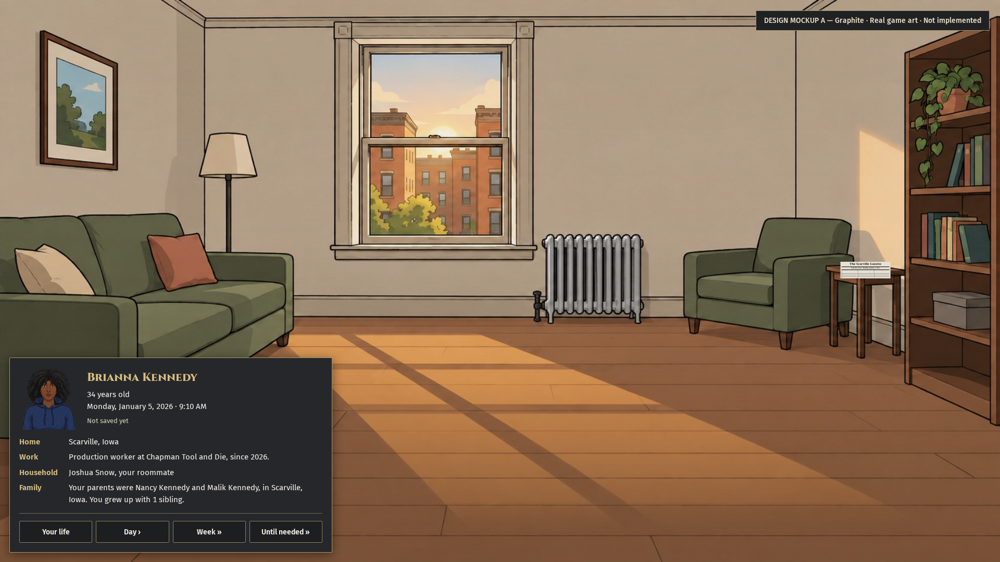
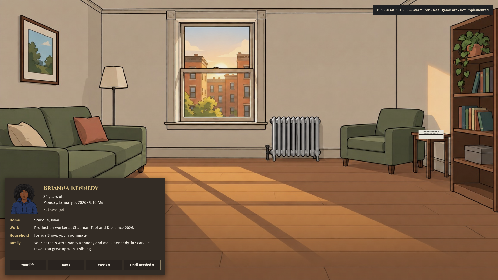
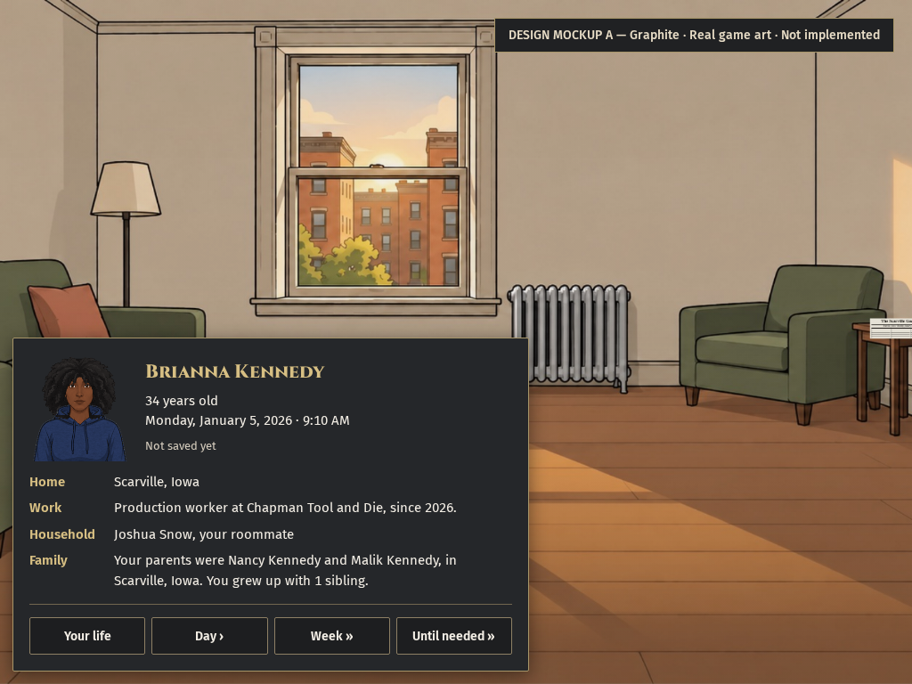
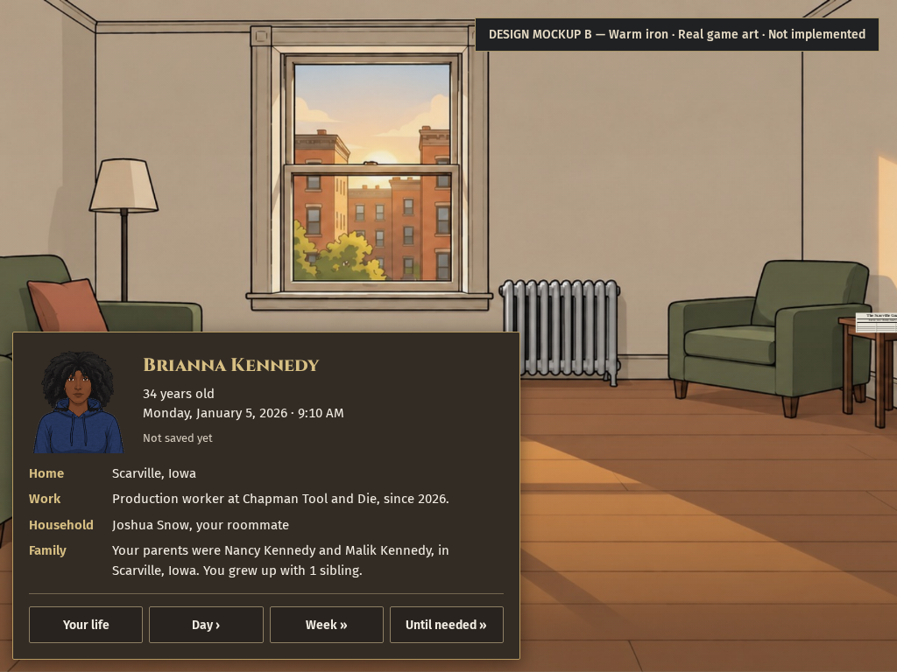

# The player card shows who she is

MERGED: None. Two design mockups show the same recorded character with a readable full name, portrait, home, work, household and family. The date sits on the card, and save status has its own line. Graphite is the recommended treatment because it gives the text a clear ground against the room. The owner must pick before implementation, as explicitly ordered in the private-note relay and CTO6005940276. Production code is unchanged.

## WHAT EMERGED

Measured: The real game opens Brianna Kennedy, age 34, in Scarville, Iowa. The existing Personal record says she is a production worker at Chapman Tool and Die, shares her household with roommate Joshua Snow, and grew up with parents Nancy and Malik Kennedy and one sibling. Both mockups copy these exact rendered records. They do not recreate the unseeded Alexander Franklin playtest or invent current spouse, children, salary or street address.

Measured: `capture-script.txt` clones the actual live portrait and reads identity, clock and Personal record elements. The two treatments use the same content and layout. Temporary browser styles hide the original dock, workspace and Morning note only for the mockups. They do not implement the ordered Morning note deletion or repair its writers.

Measured: `provenance.json` names the clean production source that supplied the art and records. The appearance shown in the mockups additionally includes explicit browser-only DOM and CSS overrides. The provenance is not evidence that the new design exists in production.

## Same layout, two treatments

A uses opaque graphite with brass text and an iron border. B uses opaque warm iron with the same hierarchy and dimensions. Both retain installed game art; no new pixels or character appearance were generated.

## Proposed tokens and states

These are design proposals, not a second production theme. Any selected treatment must map through the shared Kit 13 styles and controls under coordinated ownership.

| Item               | Shared design                                                         | A                     | B         |
| ------------------ | --------------------------------------------------------------------- | --------------------- | --------- |
| Surface            | Opaque, 2px corners                                                   | `#25272a`             | `#332c25` |
| Border             | 1px                                                                   | `#a89669`             | `#b69a61` |
| Text               | Fira UI, 15px, 1.5 line height                                        | `#f3eee5`             | Same      |
| Name               | Cinzel 800, 22px; wraps without ellipsis                              | `#d7bf83`             | Same      |
| Portrait           | Actual installed appearance, 112×120 slot                             | Same                  | Same      |
| Spacing            | 18px padding and portrait gap                                         | Same                  | Same      |
| Controls           | Shared square buttons, at least 42px tall                             | Dark iron             | Warm iron |
| Hover              | Brass border, lighter surface                                         | `#dfc581` / `#41403a` | Same      |
| Keyboard focus     | 2px brass outline, 3px offset                                         | Captured              | Captured  |
| Open/selected      | Proposed shared selected-button state for Your life                   | Not wired             | Not wired |
| Advancing/disabled | Proposed existing unavailable control state while canonical time runs | Not wired             | Not wired |
| Save error         | Proposed inline save result in the status row; preserve the full name | Not wired             | Not wired |

## Next consumer

Session 3 owns only this bottom-left card mockup and evidence. The confirmed split leaves opening cards with Session 2 and radial, Options, person-card and World-record proposals with Session 14. The selected design must later fit the adjacent radial menu. No shared stylesheet or component has been edited.

The owner pick remains required before build. The five functional draft PRs remain unchanged. Their original browser and thirty-day proof stays bound to its earlier source; these design previews are separate evidence. The shell chain still requires actual prerequisite merge, with no READY or merge authorization inferred.

## VITAL STATISTICS

Measured: One browser capture case passed. Human inspection found the full name, separate save label and all four context rows visible at both native viewports. Keyboard-focus captures are included. The preview buttons have no game action handlers. Pointer routing, canonical advancement, Save/Continue, Observer behavior and longer-name fitting have not been verified for an implementation.

Method: Clean game source `772d1bfdc36d44e23bdc34e5e07082493888e026`; random locality `1971040`; seed `session3-kit13-20261005`. Art and facts came from an ordinary native new-life opening. The first identity-only comparison is preserved separately under ignored test results and is not the final proposal. No year job ran. The exact private notes were relayed as text without screenshots, seed or recipe; none was fabricated.
