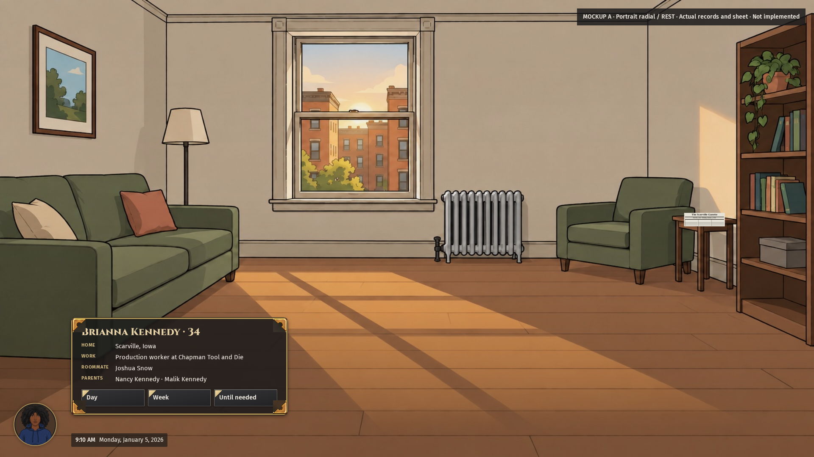
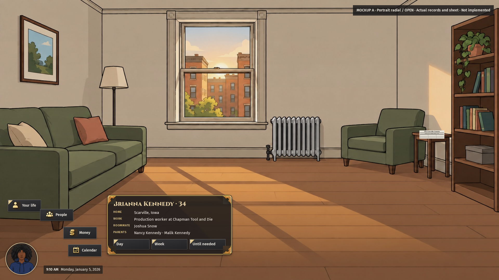
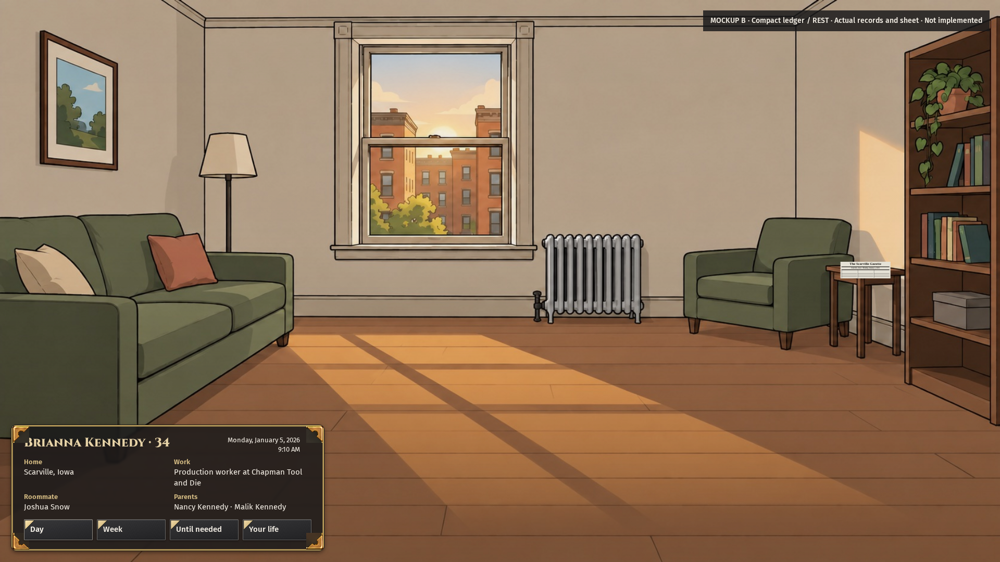
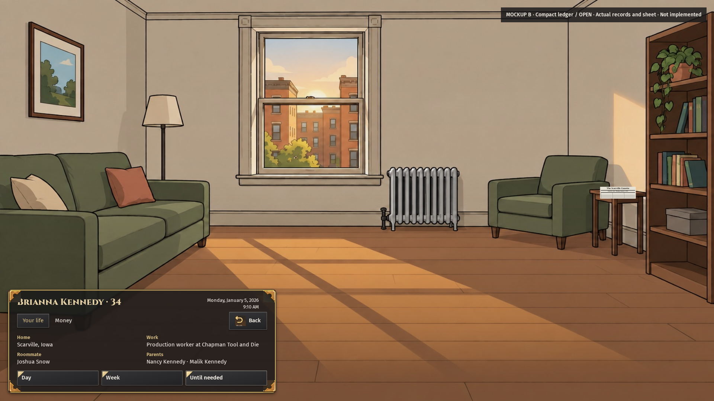

# Two smaller player-card directions, at rest and open

This preserves the completed comparison as historical evidence. The latest unified candidate belongs to Session 14 and remains unapproved. Its resting view has only the bust and clock. Do not restore the older resting card or circular portrait from these captures.

MERGED: No mockup implementation. Both directions remain unpicked. A puts the portrait at the center of the radial fan with the clock beside it. B uses a compact ledger and expands into a wider record. Both show actual relationship names, use the recovered sheet's brass ornaments and retain direct day controls. The owner must choose before production work.

## WHAT EMERGED

HARDWIRED: These are browser-only design overlays on actual game screenshots. The live World supplies Brianna Kennedy's name, age, home, portrait and work. Her rendered records supply parents Nancy Kennedy and Malik Kennedy, and roommate Joshua Snow. Unknown spouse, children and sibling names are not filled in. No counts or events are invented. The template family sentence and “Not saved yet” are absent from both designs.

A is portrait-led. The radial opens from the bottom-left portrait, which enlarges from 102 to 124 pixels. Its clock stays beside it. The card shifts right when the fan opens, keeping its facts and direct Day, Week and Until needed controls visible. The fan is a static card/radial composition for Session 14 coordination; its destinations have no game handlers.

B is a text-led ledger. At rest, the name and clock sit over two columns of home, work and relationship names. Opening Your life widens the ledger and reveals a raised-glass selected tab and the sheet's return icon. This direction does not place a portrait cutout inside a rectangle.

## Source treatment and limits

Measured: The exact recovered sheet was fetched again from corrected main and inspected before drawing. Its size is 1,509,746 bytes and SHA-256 is `347c8e90d953229458e5eef34b497f4b109c09c3cc1ba5d79a7ba3f676f0f4c0`. The original reference commit and corrected main contain those same bytes. CSS displays source-image regions for brass ornaments and gold icons; the source PNG is not repainted. Letterpress controls use the existing Kit 13 grain, primary-corner asset and action shape. The selected tab uses the existing raised-glass treatment.

The panel combines an iron surround, brass edge and source ornaments over dark translucency. Titles use Cinzel; controls use Fira Sans. The binding note also requires Andada Pro for narrative and brass-framed, dark-to-light gold progress. No narrative or progress element is added to these bounded card prototypes. The earlier Source Sans/Crimson/burgundy proposal is superseded. No binding, day circle, section divider or internal scroller is added.

The exact reference constrains component treatment. These candidate compositions have not received owner pixel approval. The earlier opaque, later text-action and intermediate two-direction previews remain preserved as historical artifacts. None is relabeled as approved.

## Fit and next step

Measured: All four native 1920 by 1080 views have zero overflowing checked elements and zero viewport-clipped checked elements. The sum of card, portrait, clock and fan rectangles occupies less than 10% of the viewport in each view. That sum excludes the design caption and is a geometric upper bound, not a measurement of opacity. Exact rectangles are in `fit-receipt.json`.

Session 3 owns this card comparison. Session 14 retains its broader radial/menu lane. The owner must pick; no production component, shared style, World writer or game command is changed by the mockups. The functional screen PRs and their source-specific checks are separate. Only a verified merge into actual main counts as main delivery, and the CTO retains merge authority.

## VITAL STATISTICS

Measured: One browser case passed in 54.9 seconds. Four final screenshots capture the two directions at rest and open. Human inspection checked the enlarged portrait, named relationships, full ledger date and sheet-derived ornaments. Prototype pointer handlers open the fan and ledger; actual game navigation, advancement and Save/Continue are not implemented by this overlay.

Latest unified candidate reference: Session 14 source `cb409b4a41c92c93ba896ffe13b7415624bf5d1d`, board comment 6008376630. Its OPEN retains donor `f7caa95003fa263b5b4afe01af17088f4a8a6821`. The owner pick remains pending.

Method: Clean served source is `58468eccd118734fa52ad99f84aea6f32aecf7e9`, bound in `provenance.json`. Seed is `session3-kit13-20261005`, locality Scarville, Iowa. The first two-direction case failed because an ornament extended beyond its frame. The next case passed layout checks, but visual review found the date underneath an ornament and a portrait captured mid-transition. The final case corrects those issues and waits for the real transition to settle. Every earlier receipt remains preserved. Storage guard refusals occurred before browser startup; byte-identical owned copies were linked without deleting their paths or content. No year job ran.
