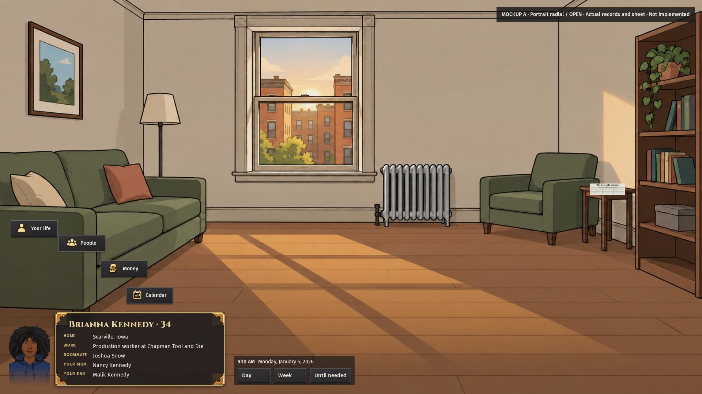
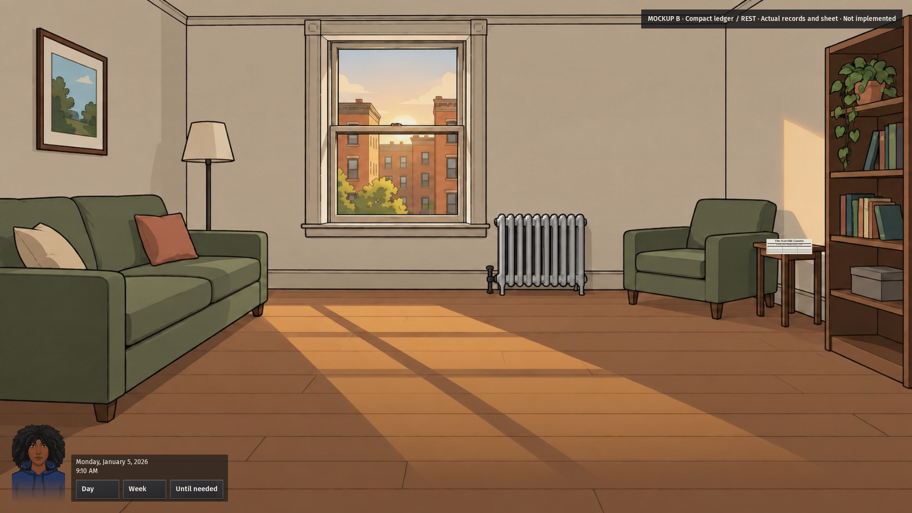
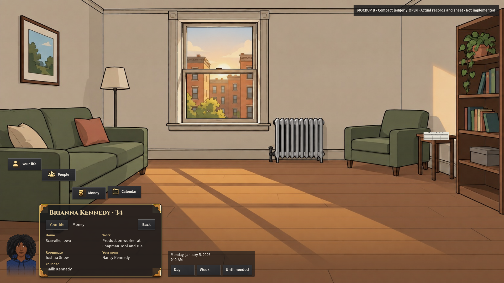

# Radial menu items have no chevrons

Both player-card comparisons now show unmarked menu items, a fading bust and a card docked beside the portrait corner. Time controls sit outside the card. The resting view shows the bust and clock without an information card. These are revised browser mockups; the owner has not selected a production design.

## What changed

Measured: Four new native 1920 by 1080 captures show A and B at REST and OPEN. The full name has extra inset so the sheet ornament does not touch its first letter. A uses fact rows; B uses a compact ledger. Both show Brianna Kennedy, her work and home, roommate Joshua Snow, and the CTO-directed mom/dad labels for Nancy Kennedy and Malik Kennedy. Original records and older pictures remain preserved.

Menu items have no primary-corner background and no chevron pseudo-elements in either state. Time buttons use ordinary faces at rest and show their static-button mark only while activated. The panel retains its approved brass corners. Those panel ornaments are not menu-item marks.

## Checks and limits

Measured: One browser case passed in 49.5 seconds. All four captures have zero checked overflow or viewport clipping, zero menu chevrons, a docked card when open, and time controls outside the card. Human inspection checked the first letter, menu faces and corner placement. The artifact checker verifies PNG dimensions, recorded fit, source identity and image hashes. This does not prove game handlers or approve a production menu.

These revisions replace the original comparison images for owner review. Session 14's unified candidate remains a separate composition; no competing production radial is built. The original four-item comparison is preserved as a bounded style study, not a claim of complete navigation implementation.

Method: Captures use actual historical game source `58468eccd118734fa52ad99f84aea6f32aecf7e9`, seed `session3-kit13-20261005`, Scarville, Iowa, with browser-only overlays. The exact recovered sheet remains bound to SHA256 `347c8e90d953229458e5eef34b497f4b109c09c3cc1ba5d79a7ba3f676f0f4c0`. The first run failed on an ambiguous bust selector. A subsequent run passed, but visual review found the name touching an ornament; the final capture adds heading inset. Storage guard refusals were preserved. Byte-identical copies were linked, old unpacked logs were archived losslessly, and terminal trace ZIPs were temporarily staged on a separate scratch mount with original paths and hashes preserved, then restored. No year benchmark ran.
