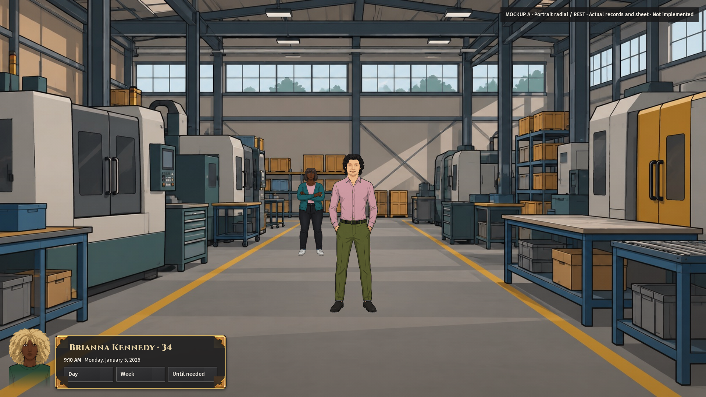
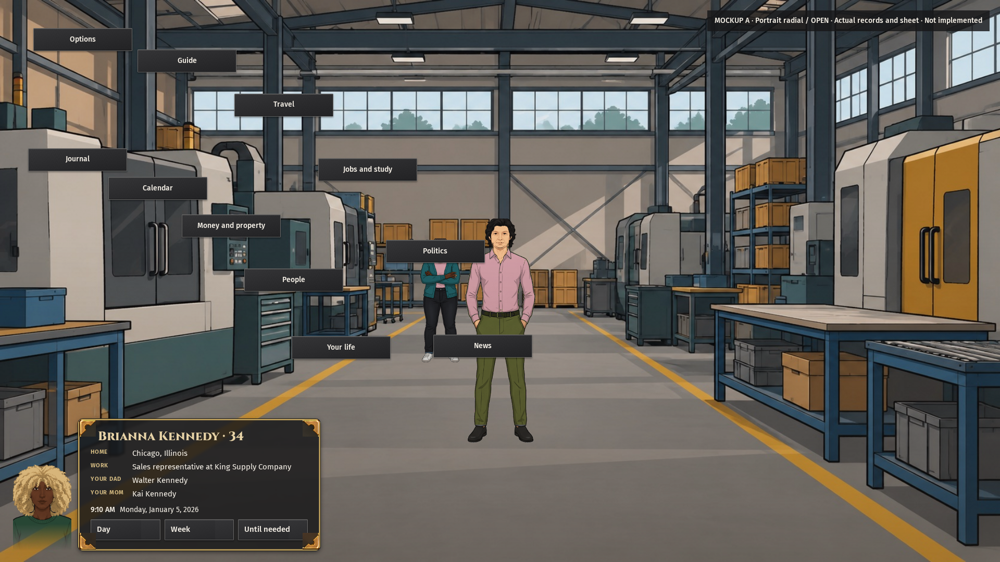
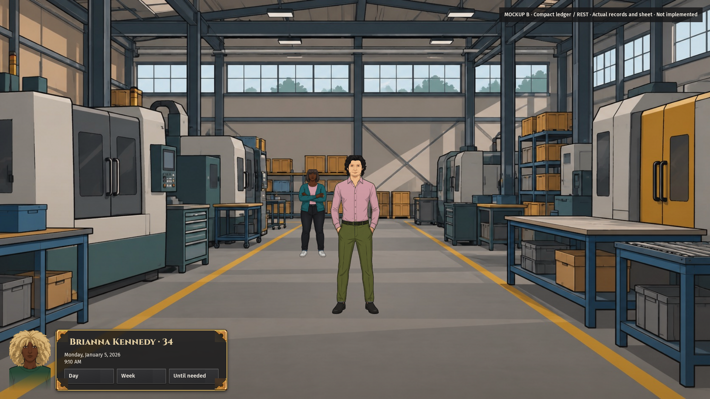

# Both card comparisons contain the clock and all destinations

The owner has not selected a production design. These revised comparisons put the date, time and Day, Week and Until needed controls on the player card. The open fan shows all 11 destinations without menu marks. Both cards stay beside the fading bust and show the full name. Earlier pictures remain preserved.

## What the pictures show

Measured: Brianna Kennedy is 34 and lives in Chicago, Illinois. Her job is sales representative at King Supply Company. The saved World names Walter Kennedy as her dad and Kai Kennedy as her mom. The card omits an empty roommate row. Home shows her recorded home town, rather than her current workplace.

A uses fact rows. B uses two columns. Neither card has tabs. The bottom family line stays inside the card and clear of the portrait. The date and controls remain inside the card at rest and open.

## Evidence and limits

Measured: One browser case passed in 1.5 minutes. The bust opened the fan by pointer and keyboard. Four native 1920 by 1080 captures report zero checked clipping, overflow, menu chevrons or text overlap with the bust. The artifact checker verifies all destination labels, card containment, PNG dimensions, hashes and served source identity.

Human inspection found the full name and family lines readable in the final pictures. The game selected a factory room for this urban opening. It did not select a residential window; this packet does not prove a Scarville apartment fix. The exact rendered asset and hash are recorded in art-lineage.json. Session 14 retains the separate Scarville art recovery.

These are browser overlays on actual game art and records. They do not implement destination handlers, prove the current main shell or its responsive behavior, or establish owner acceptance. Production selection and a fresh integrated full-shell check remain pending.

Method: The browser served historical game source `58468eccd118734fa52ad99f84aea6f32aecf7e9` with seed `session3-kit13-20261005` and the ordinary Chicago opening. The recovered approved sheet has SHA256 `347c8e90d953229458e5eef34b497f4b109c09c3cc1ba5d79a7ba3f676f0f4c0`. Initial attempts failed before capture on process permission, multiple retained Worlds and chunked save parsing. An intermediate passing capture exposed a workplace labeled Home and an empty roommate row; both were corrected before the final capture. The capture reads existing saves without changing their history. No year benchmark ran.
