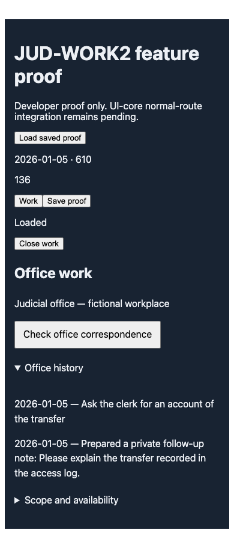
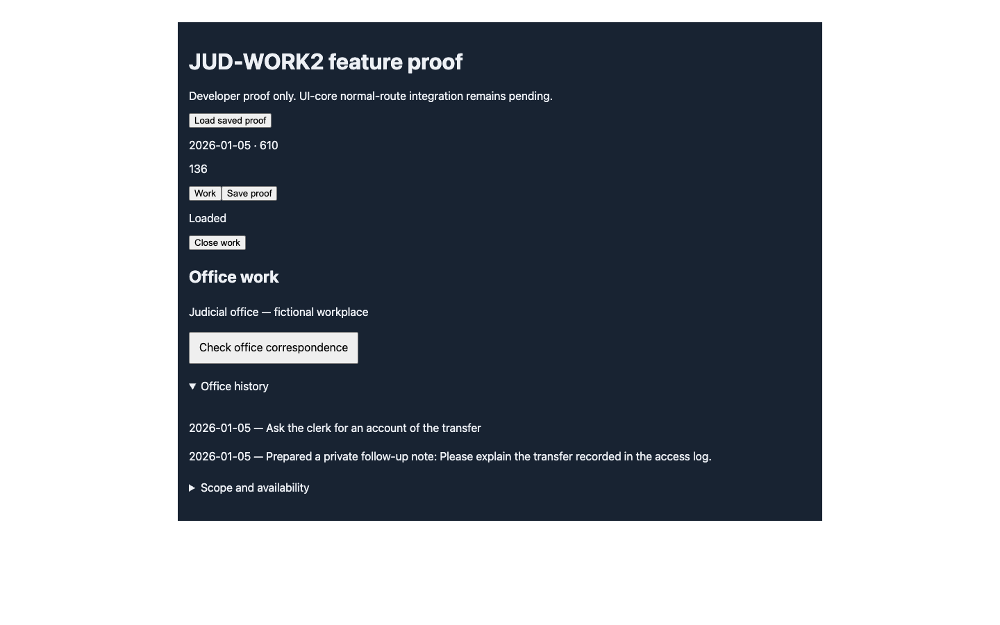

# JUD-WORK2 feature proof

Deliberately published copies of this task's run artifacts. The test itself
writes only to `test-results/jud-work2/browser`; no historical evidence images
were overwritten. These are developer feature-panel screenshots, not normal
navigation or human acceptance evidence.

- Source head: `0fe6e894f4ab4b9bb61bdf2728cf374a039b0661`.
- Checkout: `/private/tmp/pg-jud-work2`, branch `codex/jud-work2`.
- Identified launcher: `scripts/dev-identified.mjs`, port 5196, PID 92604.
- Playwright: one Chrome worker, original 30-second limit, PASS in 16.1 seconds.
- Viewports: mobile 390×844 and desktop 1440×900.
- Actual canonical correspondence → response → preparation note → IndexedDB
  save → page reload → exact saved World → history reopen.
- Pointer and keyboard activation, canonical person-link IDs, read purity,
  no browser page errors, mobile horizontal-overflow assertion passed.
- Both screenshots inspected: readable text and controls, no clipped history.

The [full unit attempt](full-unit-attempt.txt) is retained as failed evidence:
3,223 passed, 11 failed, six skipped, one sandbox bind error. It began on the
same implementation head. The measured corpus pin was corrected after its
failure was reported, so the diagnostic's later source excerpt reflects the
edited file; the executed assertion still used the old pin. The delivery report
records that repair and its separate successful checks. No full-pass claim is
made from this log.
