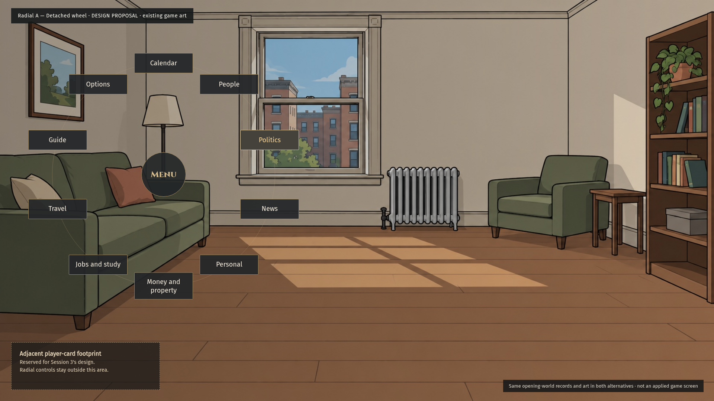
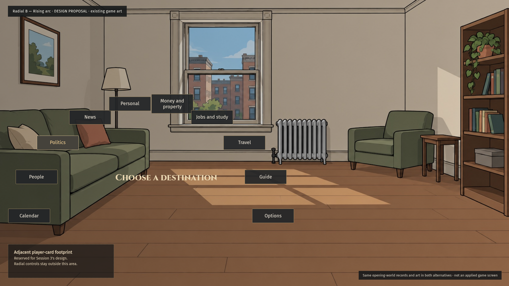
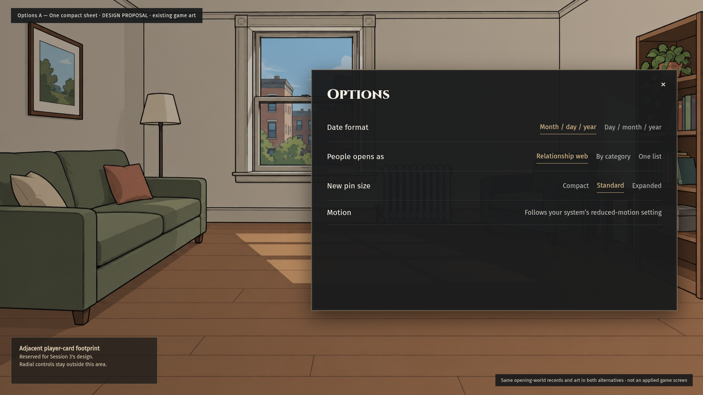
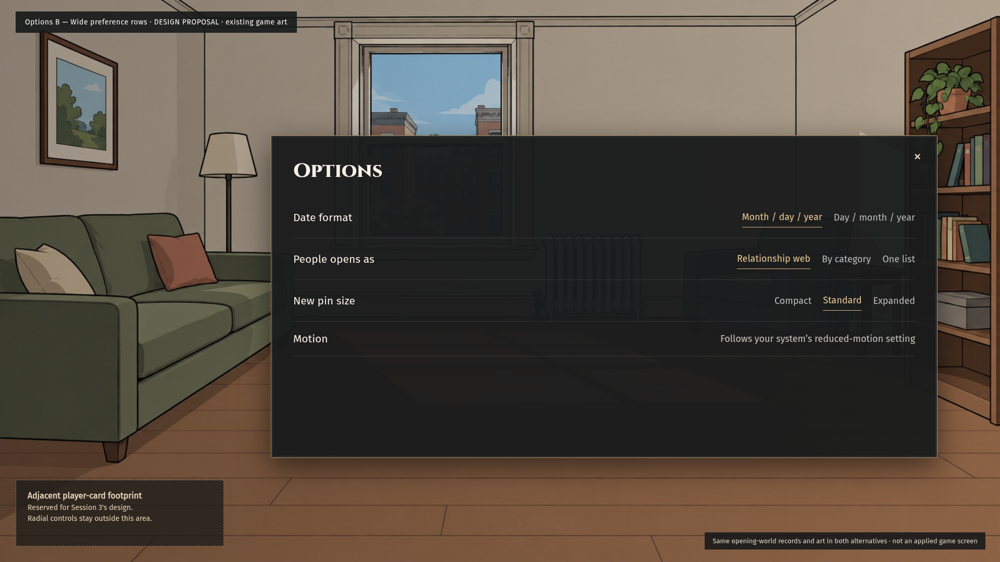
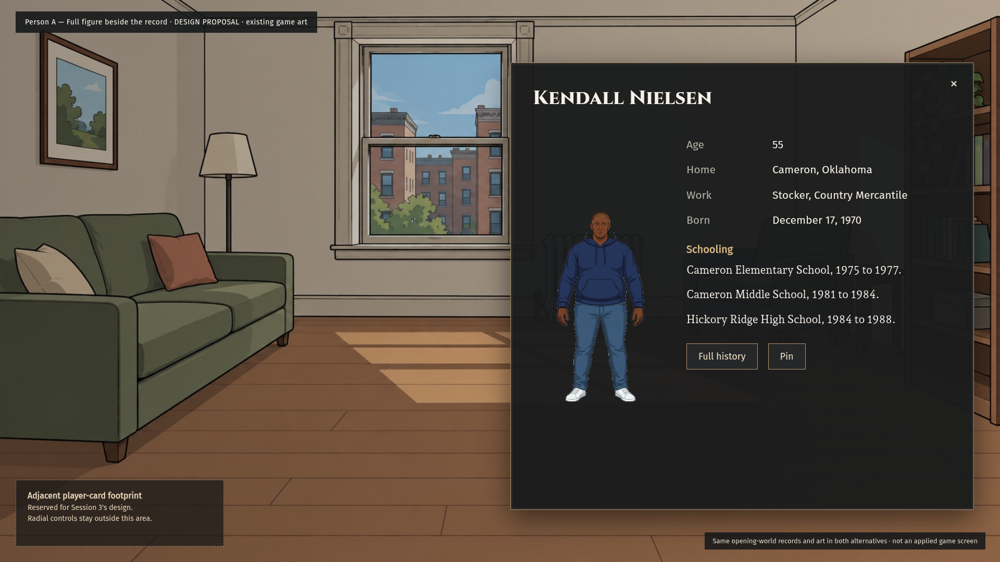
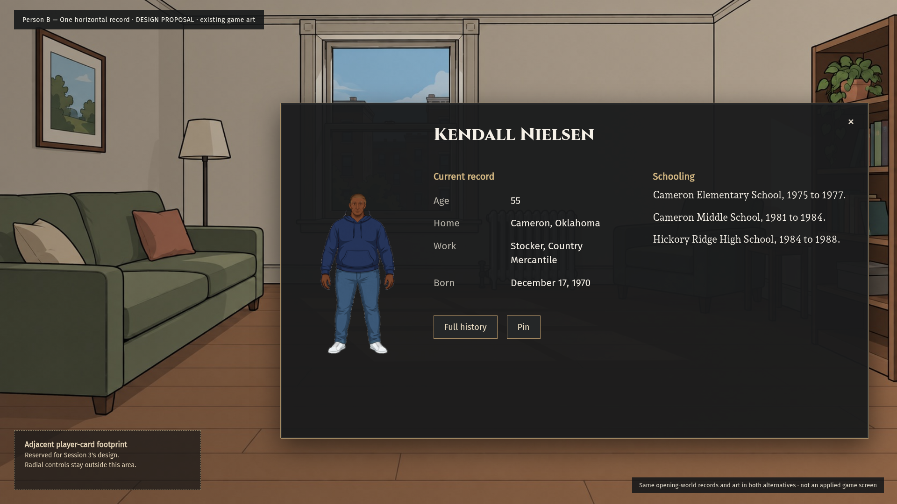
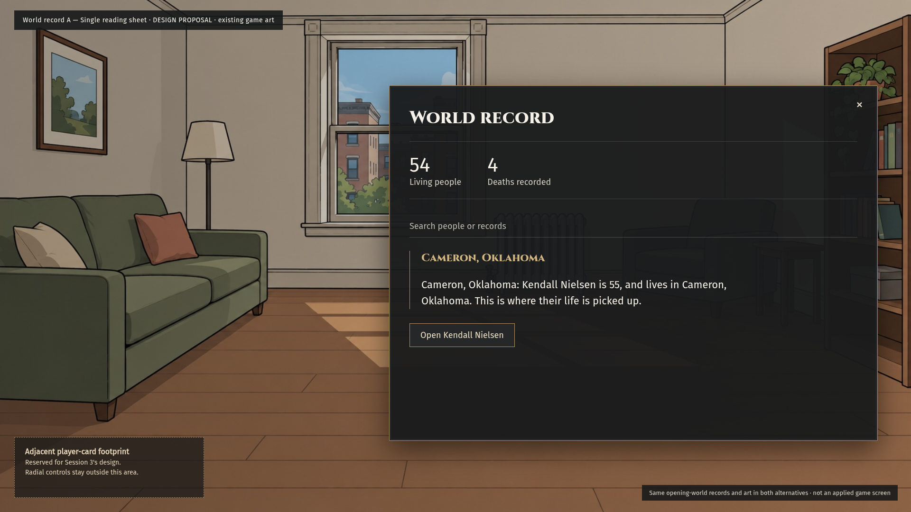
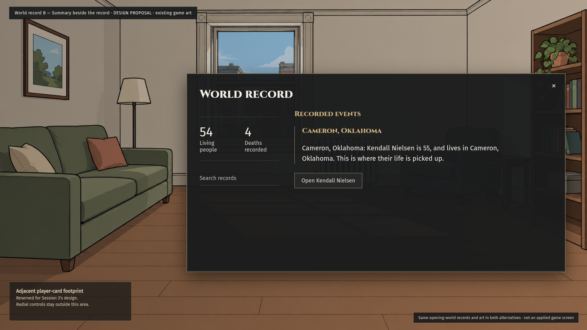

# October 5 menu proposals

> Superseded component assumptions: CTO 6006809944 / 6006838426 and main `6048b1331b9f1be7948b8827db75dcc4d6b5c1f4` establish [the binding Kit 13 rules](https://github.com/lamontaes/Political-Game-Git/blob/6048b1331b9f1be7948b8827db75dcc4d6b5c1f4/docs/ui/kit13/APPROVED-2026-10-04.md): Cinzel titles, Fira Sans controls, Andada Pro narrative; dark-to-light gold progress with brass frame; exact approved controls and shapes. Spectral/Crimson Pro/Source Sans 3 and burgundy progress assumptions are historical, not approved. Published images are preserved, not rebuilt; owner layout selection remains pending.

[Kit 13 revision 1 over an actual game screenshot](revision-1/README.md). Original eight candidates below are preserved.

Eight static proposals for owner review. No production source changes, implementation approval, runtime proof, or art approval is claimed. These drafts predate CTO comment 6006178823 and still need the reference-led revisions described below.

## Radial

| A                         | B                         |
| ------------------------- | ------------------------- |
|  |  |

## Options

| A                           | B                           |
| --------------------------- | --------------------------- |
|  |  |

## Person

| A                         | B                         |
| ------------------------- | ------------------------- |
|  |  |

## World

| A                       | B                       |
| ----------------------- | ----------------------- |
|  |  |

## Provenance and limits

- Rendered at 1920 × 1080 with Chromium. These are HTML/CSS mockups, not screenshots of applied game behavior.
- Existing game backdrop: `art/backdrops/small-apartment__midday.jpg`. It is a design stage, not a claim about the generated world's active scene.
- Person figure: existing people-art engine composite from nine existing pieces, using the generated person's canonical recipe. Asset originals were unchanged; no figure or sheet approval is implied.
- Facts came from `projectObserverPerson`, `projectObserverRecord`, `projectPersonalRecord`, and `activeWorkRelationshipsAt` at source head `af8c098372379836cc22a0b487d10f79e2049a32`. Draw seed: `session14-real-art-mockups-20261005`; ordinary opening: Cameron, Oklahoma; Kendall Nielsen, 55. No simulation advance was required.
- The sparse opening lacks bills, elections, and news. These drafts do not prove dense-record fit, pay/household presentation, observer correctness, or responsive fit. No missing facts were fabricated.
- The layouts fit the rendered canvas without internal scrolling. Person B and Options B cover too much of the room; Person A has excess panel height. Those fit limits remain open.
- Shared colors and room-visible footprint still require coordination with Sessions 2/3. Screenshot provenance annotations are outside the proposed game UI, not scene bars.
- References actually inspected after these drafts: Crusader Kings III official Steam character/dynasty screenshot `6ebda65d` and map-selection screenshot `8776b7e4`. These informed the subsequent map proposals, not a retroactive compliance claim for these eight. Options/radial and dense-record-specific study remains pending. Reference source: https://store.steampowered.com/app/1158310/Crusader_Kings_III/. No proprietary reference assets are included.
- Map A/B are separate later proposals and are not part of the eight requested here.
- Ownership: Session 14 radial/Options/person/World record/map; Session 3 player card/money/pay stub; Session 2 opening cards; Session 8 record correctness. All chat interfaces/button grids are excluded under Session 4's scene spec.

Owner selection is required before implementation. This draft is publication for review, not READY.
