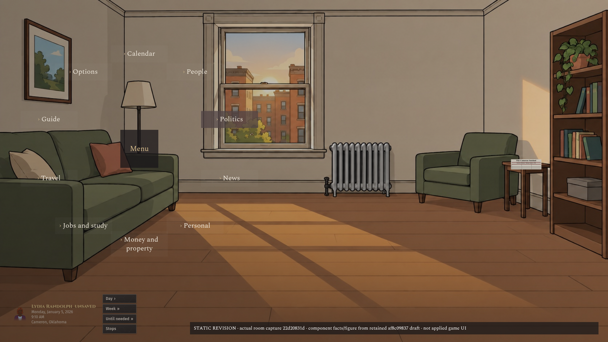
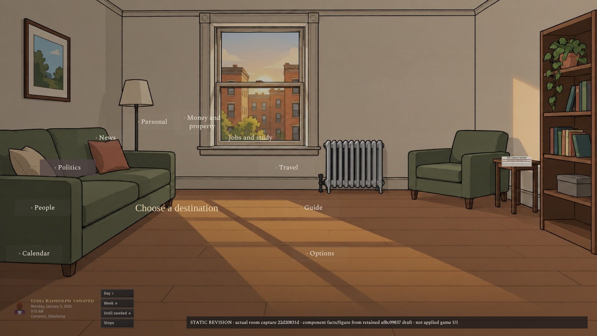
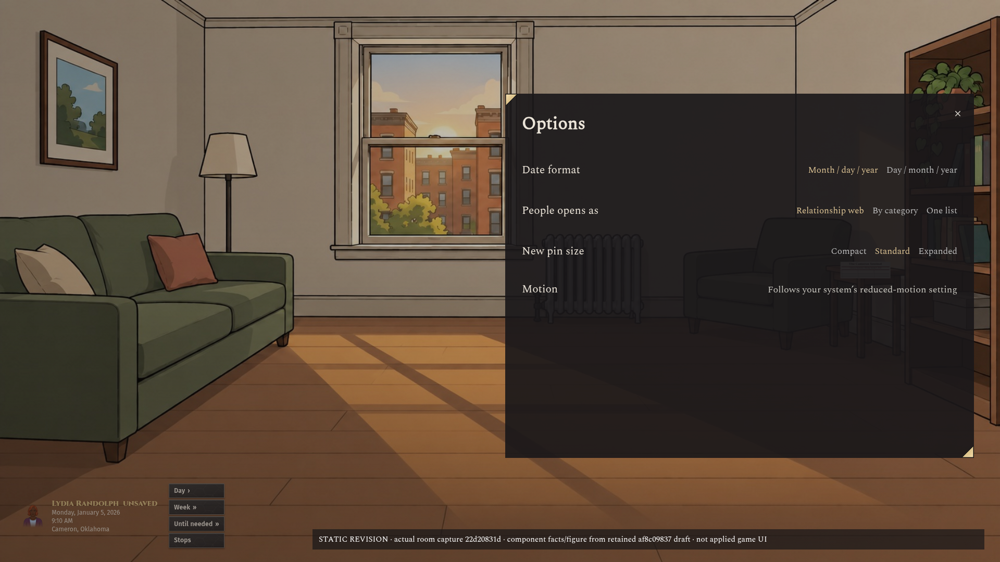
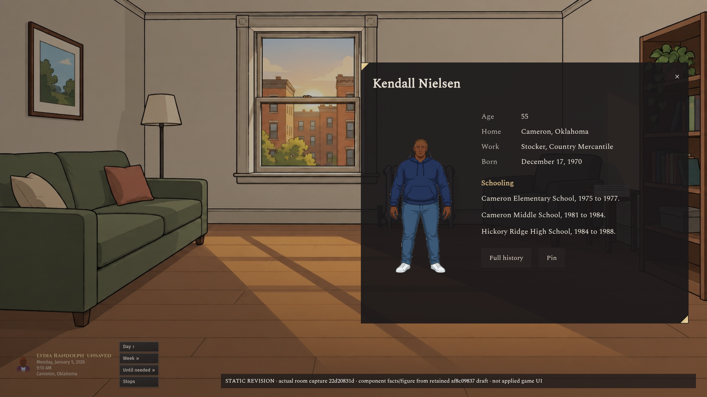
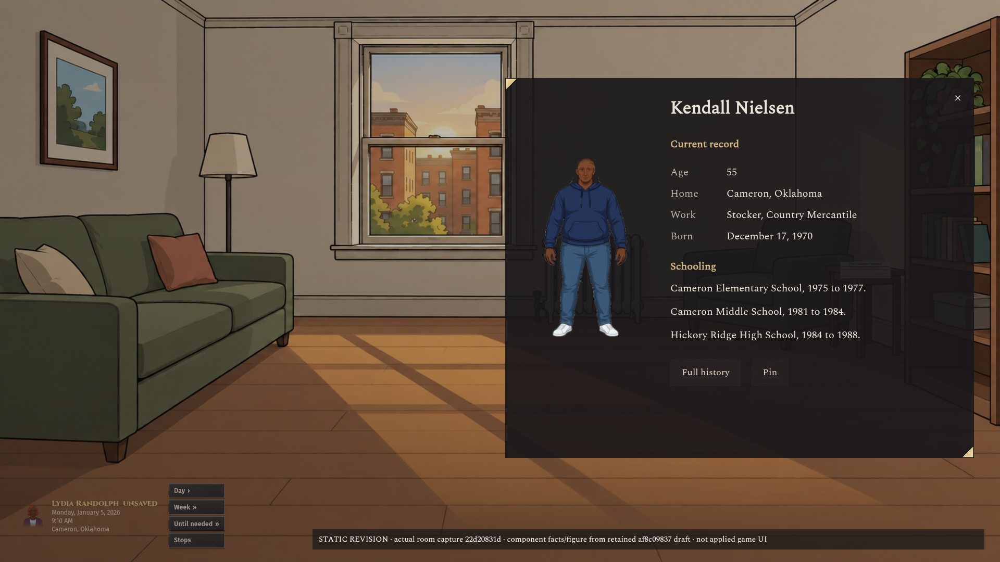
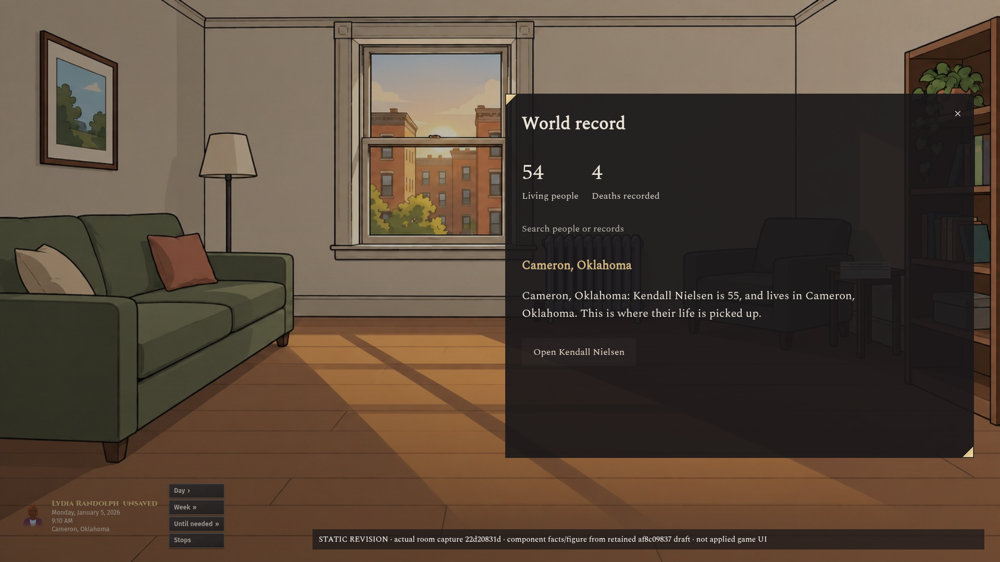
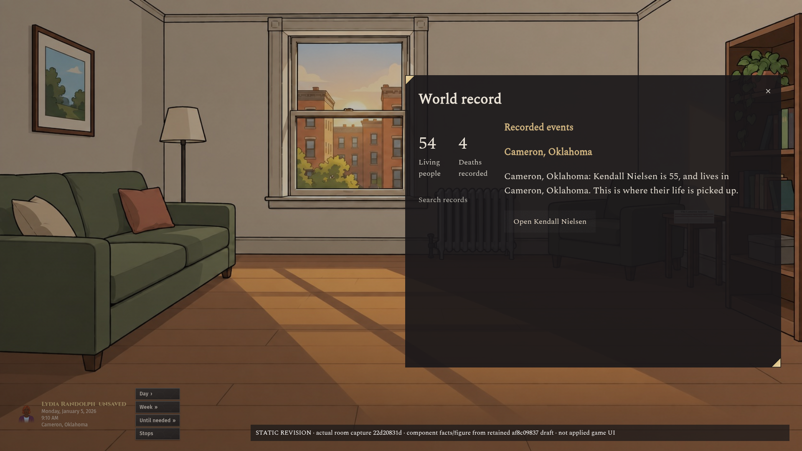

# Kit 13 revision 1

> Superseded component assumptions: CTO 6006809944 / 6006838426 and main `6048b1331b9f1be7948b8827db75dcc4d6b5c1f4` establish [the binding Kit 13 rules](https://github.com/lamontaes/Political-Game-Git/blob/6048b1331b9f1be7948b8827db75dcc4d6b5c1f4/docs/ui/kit13/APPROVED-2026-10-04.md): Cinzel titles, Fira Sans controls, Andada Pro narrative; dark-to-light gold progress with brass frame; exact approved controls and shapes. Spectral/Crimson Pro/Source Sans 3 and burgundy progress assumptions are historical, not approved. Published images are preserved, not rebuilt; owner layout selection remains pending.

Static revisions over an actual game screenshot. Original candidates remain unchanged in the parent directory. No implementation or art approval; owner selection remains pending.

## Radial

| A                         | B                         |
| ------------------------- | ------------------------- |
|  |  |

## Options

The prior A/B layouts converge to the same compact sheet in this revision; both filenames are retained for the eight-image handoff, not presented as distinct choices.

| A                           | B                           |
| --------------------------- | --------------------------- |
|  |  |

## Person

| A                         | B                         |
| ------------------------- | ------------------------- |
|  |  |

## World

| A                       | B                       |
| ----------------------- | ----------------------- |
|  |  |

## Actual screenshot and content provenance

[Unmodified room capture](actual-room-main-22d20831d.png): clean main `22d20831d9569c2c133371b3d1db77fb06a55f01`, Chromium, 1920 × 1080, isolated port 4194 and fresh browser context. Ordinary Start a life route through existing creator helpers: Cameron, Oklahoma, age 55, questions skipped; generated Lydia Randolph, January 5, 2026, 9:10 AM. The town was the retained independently drawn locality from the original mockup seed. This UI capture did not inject a World or force a scene. The route used its ordinary generated seed, which was not exported; replay identity is therefore incomplete.

The person figure, facts and sparse World record retain the separate generated Kendall Nielsen content from the original `af8c09837` draft. They are proposed menu content superimposed on the captured room, not claims about Lydia's World, the room's occupants or the game's applied behavior. Existing art originals remain unchanged.

## Applied proposal direction and limits

- Darker translucent surfaces, clean corner ornaments from existing Kit 13 `primary-corner.svg`, no binding/frame stacks, unframed search, lighter close mark, list-item chevrons, text actions without resting outlines, subtle selected-state fill.
- Spectral Regular from Google Fonts under its SIL Open Font License; proposed fine-grain button texture replaces the earlier geometric texture. Neither font nor mockup texture changes production.
- Menu panels occupy approximately the right half of the view, leaving the bottom-left actual player controls visible. The captured legacy controls are not presented as the revised Session 3 design. No scene bars were added.
- [Fit receipt](fit.json): all eight at 1920 × 1080 have zero document overflow; all six panel variants have zero internal overflow. This verifies only the sparse static content at this viewport, not dense records, responsive sizes or interactive behavior.
- References actually inspected: official Crusader Kings III character/dynasty screenshot `6ebda65d` (compact identity/facts, related content beside the portrait), and map selection screenshot `8776b7e4` (map dominance, adjacent details). Source: https://store.steampowered.com/app/1158310/Crusader_Kings_III/. No proprietary reference assets included. Options/radial/dense-record-specific reference study remains open; these revisions are not claimed to fulfill that requirement merely by using CK3 styling.
- The light close mark is a proposal, not a final approved X design. No dropdown, slider, progress, Lie or scene exchange is added merely to illustrate controls unrelated to these surfaces.
- Organizer/podium sizing requires its actual scene consumer receipt; this empty apartment capture cannot establish that repair. Shared palette/footprint coordination with Sessions 2/3 remains open.

No READY, correctness repair, scene-spec implementation or art approval is claimed.
