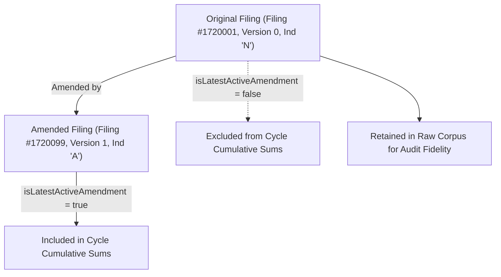

# FEC Federal Campaign-Finance Source Corpus

This document specifies the normalized data models, source vs synthetic observation classification, amendment resolution mechanics, calibration metrics, and known limitations for the Federal Election Commission (OpenFEC) campaign finance source corpus.

---

## 1. Principles & Scope

1. **Source vs Synthetic Segregation**: All observations are explicitly classified:
   - `actual_openfec`: Direct authentic observation from official OpenFEC disclosure.
   - `transformed_official`: Standardized/derived from official OpenFEC disclosures.
   - `synthetic_fixture`: Deterministic synthetic fixture constructed for unit testing.
     **Crucial Invariant**: Synthetic fixtures are strictly prevented from entering empirical calibration aggregates.
2. **Simulation Boundary**: Pure source data and calibration models live strictly outside the core simulation state (`src/simulation/`). Slice E and existing campaign finance mechanics remain untouched.
3. **No Double-Counting of Amended Reports**: The FEC preserves all original filings and subsequent amendments. When aggregating financial summaries over cycles or reporting periods, only the **active superseding amendment** is counted, while full historical filings and itemizations remain available for auditing.
4. **Secret-Free Operation**: API interactions default to `process.env.FEC_API_KEY || 'DEMO_KEY'`. No credentials or API keys are embedded in source code, fixtures, or tests.
5. **Distinct Debt vs Loan Semantics**: Candidate personal loans (Schedule C) are distinct from vendor trade obligations (Schedule D). Candidate loans represent personal capital risk and repayment potential, while vendor debts represent unpaid trade invoices.

---

## 2. Core Normalized Data Models

### 2.1 Candidate (`FecCandidate`)

Federal candidates registered with the FEC:

- `candidateId`: 9-character alphanumeric identifier (`H` for House, `S` for Senate, `P` for President, e.g., `H2KY06097`, `S0KY00010`, `P80001571`).
- `name`: Candidate full legal name (e.g., `BARR, ANDY`).
- `office`: `'H' | 'S' | 'P'`.
- `state`: 2-letter state code (`KY`, `US` for presidential).
- `district`: 2-digit district code (`06`, `00` for statewide/presidential).
- `party`: Standard FEC party code (`REP`, `DEM`, `LIB`, `IND`).
- `partyAffiliation`: Normalized party label (`Republican Party`, `Democratic Party`).
- `cycles`: Array of election cycles active (`[2022, 2024]`).
- `incumbentChallengeStatus`: `'I'` (Incumbent), `'C'` (Challenger), `'O'` (Open Seat), `'U'` (Unknown).
- `principalCampaignCommitteeId`: Committee ID designated as Principal Campaign Committee (`C00473538`).
- `recordClass`: `'actual_openfec' | 'transformed_official' | 'synthetic_fixture'`.

### 2.2 Committee (`FecCommittee`)

Registered political committees:

- `committeeId`: 9-character alphanumeric identifier starting with `C` (e.g., `C00473538`).
- `name`: Committee official name.
- `committeeType`:
  - `H`: House Authorized/Principal
  - `S`: Senate Authorized/Principal
  - `P`: Presidential Authorized/Principal
  - `N`: Non-qualified PAC
  - `Q`: Qualified PAC
  - `O`: Independent Expenditure-Only (Super PAC)
  - `U`: Single-Candidate Super PAC
  - `X`: Party Committee (Non-qualified)
  - `Y`: Party Committee (Qualified)
  - `Z`: National Party Non-federal Account
  - `W`: Leadership PAC
- `designation`:
  - `P`: Principal Campaign Committee
  - `A`: Authorized by Candidate
  - `J`: Joint Fundraising Committee
  - `D`: Leadership PAC
  - `U`: Unauthorized
  - `B`: Lobbyist/Registrant PAC
- `treasurerName`: Official custodian of records.
- `sponsorCandidateId`: Linked candidate if authorized or leadership PAC.
- `recordClass`: `'actual_openfec' | 'transformed_official' | 'synthetic_fixture'`.

### 2.3 Candidate-Committee Relationship (`CandidateCommitteeRelationship`)

Maps the formal network between candidates and committees across cycles:

- `relationshipId`: Canonical composite key (`rel-<candidateId>-<committeeId>-<cycle>-<designation>`).
- `designation`: Role of the committee for the candidate in that cycle.
- `isPrincipalCampaignCommittee`: Boolean indicating primary election vehicle.
- `recordClass`: `'actual_openfec' | 'transformed_official' | 'synthetic_fixture'`.

### 2.4 Filing / Report (`FecFilingReport`)

Financial disclosure reports submitted on statutory deadlines:

- `filingId`: Raw FEC document sequence / electronic file number (e.g., `1730001`).
- `formType`: Form `F3` (House/Senate), `F3P` (Presidential), `F3X` (PAC/Party), `F24` (24-Hour Notice), `F5` (Non-committee IE).
- `reportType`: Periodic code (`Q1`, `Q2`, `Q3`, `YE`, `12P`, `12G`, `30G`, `M2`-`M12`, `24`, `48`).
- `coverageStartDate` / `coverageEndDate`: Exact calendar period covered.
- `receiptDate`: Date filing was received by the FEC.
- `amendmentChain`:
  - `amendmentIndicator`: `'N'` (New), `'A'` (Amendment), `'T'` (Termination).
  - `amendmentVersion`: 0 for original, 1+ for subsequent amendments.
  - `amendsFilingId`: Preceding filing ID being modified.
  - `isLatestActiveAmendment`: Boolean indicating whether this is the active authority for the period.
  - `supersededByFilingId`: Replacement filing ID if this filing has been amended.
- `financialSummary`:
  - `totalReceipts`, `totalDisbursements`, `cashOnHandBeginningPeriod`, `cashOnHandClosePeriod`.
  - `debtsOwedByCommittee`, `debtsOwedToCommittee`.
  - `individualContributionsTotal` (broken down into `individualItemizedContributions` [>= $200] and `individualUnitemizedContributions` [< $200]).
  - `otherPoliticalCommitteeContributions` (PACs), `transfersFromOtherAuthorizedCommittees`, `candidateContributions`.
  - `loansMadeByCandidate`, `otherLoans`, `operatingExpenditures`, `refunds`, `independentExpendituresTotal`.
- `recordClass`: `'actual_openfec' | 'transformed_official' | 'synthetic_fixture'`.

### 2.5 Itemized Receipts (Schedule A) & Disbursements (Schedule B)

- **Receipts (`FecReceiptItem`)**: Itemized individual donations, PAC transfers, party contributions, and candidate personal contributions.
- **Disbursements (`FecDisbursementItem`)**: Operating expenditures, media production/airtime, polling fieldwork, staff payroll, consulting retainers, direct mail postage, and travel logistics.

### 2.6 Loans (Schedule C) vs Debts & Obligations (Schedule D)

- **Loans (`FecLoanRecord`)**: Explicit promissory notes (candidate personal loans, commercial bank loans). Captures `originalLoanAmount`, `cumulativePaymentToDate`, `loanBalanceRemaining`, `interestRate`, and `loanDueDate`.
- **Debts (`FecDebtRecord`)**: Incurred vendor accounts payable and unbilled obligations (e.g., unpaid direct mail printing, legal retainers, media booking fees). Captures `beginningBalanceThisPeriod`, `amountIncurredThisPeriod`, `amountPaidThisPeriod`, and `endingBalanceThisPeriod`.

### 2.7 Independent Expenditures (Schedule E / Form 24 / Form 5)

Outside spending expressly advocating the election or defeat of a candidate without candidate coordination:

- `expenditureId`: Unique transaction ID.
- `committeeId` / `committeeName`: Super PAC or organization making the expenditure.
- `candidateId` / `candidateName`: Targeted candidate.
- `officeSought` / `state` / `district`: Target race.
- `supportOppose`: `'S'` (Support) or `'O'` (Oppose).
- `payeeName` / `purpose`: Vendor and ad description (e.g., `TV ADVERTISEMENT - SUPPORT ANDY BARR`).
- `disbursementDate` / `disseminationDate`: Accounting date and public broadcast date.

---

## 3. Amendment Resolution Mechanics

1. **Grouping**: Filings are grouped by `committeeId + cycle + reportType + coverageStartDate + coverageEndDate`.
2. **Ordering**: Filings within a group are sorted by `receiptDate` ascending, then `amendmentVersion` ascending, then `filingId` ascending.
3. **Active Selection**: The final filing in the sorted chain is marked `isLatestActiveAmendment = true`, `supersededByFilingId = null`.
4. **Historical Linking**: Earlier filings in the chain are marked `isLatestActiveAmendment = false`, `supersededByFilingId = <latestFilingId>`, and their `amendsFilingId` is linked.
5. **Aggregation Guard**: Functions like `filterActiveFilings()` and `aggregateActiveCommitteeFinances()` strictly evaluate active reports, ensuring cumulative fundraising, cash-on-hand, and burn rates remain statistically accurate without double-counting.

---

## 4. Simulation Calibration Outputs & Segregation

The corpus compiler derives two calibration profiles:

1. `data/campaign_finance/calibration/calibration_benchmarks.json`: **Empirical Profile** (strictly filters out all synthetic fixtures; sample sizes reflect genuine federal candidates and disclosures).
2. `data/campaign_finance/calibration/synthetic_test_calibration.json`: **Synthetic Test Profile** (clearly labelled test calibration).

Calibration metrics include:

- **Office Fundraising Benchmarks**: Median, mean, P25, P75, P90 receipts and disbursements for House, Senate, and Presidential races.
- **Campaign Phase Burn Rates**: `early_off_year`, `primary_season`, `general_sprint`, and `post_election_wind_down`.
- **Debt Prevalence**: Proportion of committees carrying debt and personal loan vs vendor debt splits.
- **Donor Distributions**: Small-dollar unitemized vs itemized individuals vs PACs vs self-funding.
- **Outside Spending Scale**: Super PAC independent expenditure ratio and support/oppose split.
- **Committee Network Topology**: Ratio of PCCs, Leadership PACs, and Joint Fundraising Committees.
- **Filing Cadence**: Periodic filing distributions and historical amendment rates.

---

## 5. Known OpenFEC Dataset Limitations & Caveats

1. **Small-Dollar Donor Masking**: Federal law only requires itemization for individual contributions aggregating over $200 per election cycle. Grassroots donations below this threshold appear only in aggregate on Line 11(a)(ii) (unitemized). Individual donor details (names, occupations, employers) cannot be extracted for small-dollar donors.
2. **Joint Fundraising Double-Counting in Raw Data**: Joint Fundraising Committees (JFCs) collect contributions and subsequently transfer net proceeds to participating candidate committees and party committees. Raw OpenFEC summaries include both the JFC receipts and the candidate committee transfer receipts. Calibration models must account for transfer lines to avoid double-counting national fundraising volume.
3. **Fast Notices (Form 24 / 48-Hour Notices)**: 24-hour and 48-hour notices for independent expenditures or large last-minute contributions are filed during the immediate pre-election window and are subsequently re-reported on regular quarterly/post-general filings. The amendment resolver and calibration engine treat 24-hour notice filings as immediate event signals rather than additive new funds when aggregating full-period reports.
4. **Candidate Loan Repayment Restrictions (BCRA § 304 / FEC v. Ted Cruz for Senate)**: Federal law previously limited the amount of post-election contributions that could be used to repay candidate personal loans exceeding $250,000. While Supreme Court jurisprudence struck down the $250,000 post-election repayment cap, candidate self-loans remain distinct from commercial debt because candidates frequently forgive their personal loans rather than demanding liquid repayment from an empty campaign treasury.
5. **Nightly Ingestion Latency & Periodic Historical Updates**: OpenFEC updates nightly, but filers frequently submit amendments months or years after an election cycle has concluded (e.g., following FEC audit findings or termination reconciliations). Corpus datasets record their exact retrieval vintage and SHA-256 digest.

---

## 6. Provenance & Build Verification

- **Compiler CLI**: `npm run compile:campaign-finance`
- **Validator CLI**: `npm run validate:campaign-finance`
- **Calibration Inspector CLI**: `npm run calibration:campaign-finance`
- **Test Suite**: `npm run test:campaign-finance`
