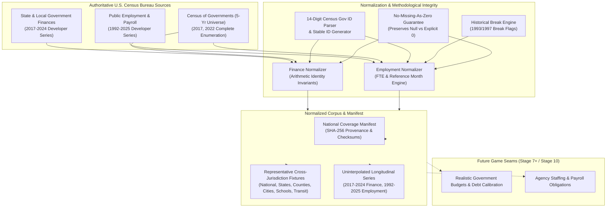

# State and Local Government Finance & Employment Source Corpus

## 1. System Overview

The **Government Finance & Employment Source Corpus** is the authoritative, normalized data layer grounded directly in U.S. Census Bureau datasets:

- **State and Local Government Finances (SLF)**: Current published developer series covering **2017–2024**.
- **Public Employment and Payroll (APEP / CoG Employment)**: Current published developer series covering **1992–2025**.

This corpus establishes the foundational data substrate for later calibrating realistic government budgets, debt structures, public staffing allocations, and monthly payroll obligations across federal, state, county, municipal, school district, and special district entities.

---

## 2. Core Methodological Invariants

1. **Zero Simulation Mutation**: `src/simulation/` remains untouched. This corpus represents real-world source evidence with full provenance (Constitution Principle 25), not canonical simulated world state.
2. **Census vs. Annual Survey Differentiation**:
   - Every record carries explicit `enumerationType`:
     - `"complete_census"`: 5-year Census of Governments (years ending in 2 and 7, e.g. 2017, 2022) with full universe enumeration.
     - `"annual_survey_sample"`: Intervening annual surveys (e.g. 2018–2021, 2023–2024) based on probability sampling of local governments and full enumeration of state governments.
     - `"state_level_aggregate"` / `"national_aggregate"`: Census-compiled totals.
3. **No Silently Interpolated Years**: Missing survey years are never fabricated or linearly interpolated. Missing years remain absent.
4. **No Missing-As-Zero**: When a source item is omitted, unreported, or uncollected, it remains `null` / `undefined`. `0` is strictly reserved for explicitly reported zero dollars or zero headcount.
5. **Historical Definition Compatibility**:
   - When comparing longitudinal series across historical breaks (such as the **1997 shift from October to March** reference month, or the **1993 split of sworn police officers (code 025) vs other police (code 026)**, or education instructional splits), explicit `isDefinitionCompatible` and `breakInSeries` flags are attached.
6. **Arithmetic Identity Preservation**:
   - Mathematical accounting identities are verified on every finance record:
     $$\text{Total Revenue} = \text{General Revenue} + \text{Utility Revenue} + \text{Liquor Store Revenue} + \text{Insurance Trust Revenue}$$
     $$\text{General Revenue} = \text{Own Source Revenue} + \text{Intergovernmental Revenue}$$
     $$\text{Own Source Revenue} = \text{Taxes} + \text{Current Charges} + \text{Miscellaneous General Revenue}$$
     $$\text{Total Expenditure} = \text{Direct Expenditure} + \text{Intergovernmental Expenditure}$$
     $$\text{Direct General Expenditure} = \text{Direct Expenditure} - (\text{Utility} + \text{Liquor} + \text{Insurance Trust})$$
     $$\text{Direct General Expenditure} = \text{Current Operation} + \text{Capital Outlay} + \text{Assistance/Subsidies} + \text{Interest on General Debt}$$
7. **Census API Key Safety**: Uses `process.env.CENSUS_API_KEY` if available; operates safely in keyless public developer mode or offline fixture mode; never fabricates fake credentials.

---

## 3. Government Identification Architecture

Census Government Identification uses a 14-digit structured code:

$$\underbrace{\text{SS}}_{\text{State (2d)}}\ \underbrace{\text{T}}_{\text{Type (1d)}}\ \underbrace{\text{CCC}}_{\text{County Area (3d)}}\ \underbrace{\text{UUU}}_{\text{Unit (3d)}}\ \underbrace{\text{FFF}}_{\text{Function (3d)}}\ \underbrace{\text{SS}}_{\text{Subunit (2d)}}$$

- **Type Code Mapping**:
  - `0`: Federal / National Summary
  - `1`: State Government
  - `2`: County Government
  - `3`: Municipal Government
  - `4`: Township Government
  - `5`: Special District Government
  - `6`: Independent School District Government

### Stable Identifier Conventions

- **Government Entity**: `gov-census-${censusGovId}` (e.g. `gov-census-18203400100000` for Lexington-Fayette Urban County Government)
- **Finance Record**: `gov-fin-${censusGovId}-${fiscalYear}-${vintage}`
- **Employment Record**: `gov-emp-${censusGovId}-${surveyYear}-${functionCode}-${vintage}`
- **Function**: `gov-func-${functionCode}` (e.g. `gov-func-024` for Fire Protection)

---

## 4. Government Finance Taxonomy

### Revenue Concepts

- **Taxes**:
  - Property Taxes (`T01`)
  - General Sales and Gross Receipts (`T09`)
  - Selective Sales Taxes (Motor Fuel `T11`, Alcoholic Beverages `T10`, Tobacco `T13`, Public Utilities `T12`, Insurance Premiums `T14`, Other `T19`)
  - Individual Income Taxes (`T40`)
  - Corporation Net Income Taxes (`T41`)
  - License Taxes (Motor Vehicles `T24`, Corporations in General `T22`, Other `T28`)
  - Other Taxes (Severance `T53`, Death/Gift `T50`, Documentary/Stock Transfer `T51`)
- **Intergovernmental Revenue**:
  - From Federal Government (`B01`–`B99`)
  - From State Government (`C01`–`C99`)
  - From Local Governments (`D01`–`D99`)
- **Current Charges**: Education, Hospitals, Highways/Tolls, Sewerage, Solid Waste, Parks/Recreation, Air Transportation, Ports, etc.
- **Miscellaneous General Revenue**: Special Assessments, Interest Earnings, Sale of Property, Other.
- **Utility Revenue**: Water Supply (`A91`), Electric Power (`A92`), Gas Supply (`A93`), Public Transit (`A94`).
- **Insurance Trust Revenue**: Employee Retirement, Unemployment Compensation, Workers' Compensation.

### Expenditure Concepts

- **Character / Object Classes**:
  - Current Operation (personnel compensation, contractual services, supplies)
  - Capital Outlay (Construction, Purchase of Land & Existing Structures, Equipment)
  - Assistance and Subsidies (cash assistance, public welfare assistance)
  - Interest on General Debt
  - Insurance Benefits and Repayments
- **Functional Expenditure Categories**:
  - Education: Elementary & Secondary, Higher Education, Other Education, Libraries
  - Social & Health Services: Public Welfare, Hospitals, Public Health
  - Public Safety: Police Protection, Fire Protection, Correction
  - Infrastructure & Environment: Highways & Streets, Sewerage, Solid Waste Management, Natural Resources, Parks & Recreation, Housing & Community Development
  - Administration & Governance: Financial Administration, Judicial and Legal, General Public Buildings, Central Administration
  - Utilities: Water Supply, Electric Power, Gas Supply, Mass Transit

### Debt & Assets

- **Debt Outstanding at End of Fiscal Year**:
  - Short-Term Debt (tax anticipation notes, bond anticipation notes due $\le 1\text{ year}$)
  - Long-Term Debt: Full Faith and Credit (general obligation) vs. Nonguaranteed Revenue Debt (pledged enterprise revenues)
  - Debt Issued & Debt Retired during the year
- **Cash and Security Holdings (Assets)**:
  - Insurance Trust Funds
  - Non-Insurance Trust Funds: Sinking Funds (debt service), Bond Funds (capital projects), Other Funds (general & special reserve)

---

## 5. Public Employment and Payroll Taxonomy

- **Function Codes**: 3-digit Census classification codes (e.g. `000` Total, `012` Elementary/Secondary Instruction, `014` Elementary/Secondary Other, `018` Higher Ed Instruction, `024` Fire, `025` Police Officers, `026` Police Other, `028` Correction, `055` Highways, `059` Transit, `062` Water, `091` Central Administration, `092` Financial Administration, `093` Judicial/Legal).
- **Headcount**:
  - Full-Time Employees (regularly scheduled $\ge 35\text{ hours/week}$ or standard full-time)
  - Part-Time Employees
  - Total Headcount ($=\text{Full-Time} + \text{Part-Time}$)
- **Payroll (Monthly in US Dollars)**:
  - Full-Time Monthly Payroll
  - Part-Time Monthly Payroll
  - Total Monthly Payroll ($=\text{Full-Time Payroll} + \text{Part-Time Payroll}$)
  - Average Full-Time Monthly Salary ($=\text{Full-Time Payroll} / \text{Full-Time Headcount}$)
- **Full-Time Equivalent (FTE)**:
  - Reported FTE or standard Census calculation:
    $$\text{FTE} = \text{Full-Time Headcount} + \frac{\text{Part-Time Hours}}{160} \quad \text{or} \quad \text{Full-Time Headcount} + \frac{\text{Part-Time Payroll}}{\text{Average Full-Time Salary}}$$

---

## 6. Representative Fixtures & Coverage

The corpus includes authentic representative fixtures across government tiers:

| Government Level             | Entity Name                                   | Census Gov ID    | State | Sample Years                   |
| ---------------------------- | --------------------------------------------- | ---------------- | ----- | ------------------------------ |
| **National Aggregate**       | United States State & Local Aggregate         | `00000000000000` | US    | Fin: 2017–2024, Emp: 1992–2025 |
| **State Government**         | Commonwealth of Kentucky                      | `18100000000000` | KY    | Fin: 2017–2024, Emp: 1992–2025 |
| **State Government**         | State of Texas                                | `44100000000000` | TX    | Fin: 2017–2024, Emp: 1992–2025 |
| **State Government**         | State of California                           | `05100000000000` | CA    | Fin: 2017–2024, Emp: 1992–2025 |
| **State Government**         | State of New York                             | `33100000000000` | NY    | Fin: 2017–2024, Emp: 1992–2025 |
| **City/County Consolidated** | Lexington-Fayette Urban County Government     | `18203400100000` | KY    | Fin: 2017, 2022, Emp: 2022     |
| **County Government**        | Travis County                                 | `44222700000000` | TX    | Fin: 2022, Emp: 2022           |
| **Municipal Government**     | City of Austin                                | `44322700200000` | TX    | Fin: 2022, Emp: 2022           |
| **Municipal Government**     | City of New York                              | `33303100100000` | NY    | Fin: 2022, Emp: 2022           |
| **School District**          | Fayette County Public Schools                 | `18603400100000` | KY    | Fin: 2022, Emp: 2022           |
| **Special District**         | Capital Metropolitan Transportation Authority | `44522700100000` | TX    | Fin: 2022, Emp: 2022           |

---

## 7. CLI Tools & Package Commands

- `npm run compile:gov-finance` — Compiles normalized records and generates national coverage manifest.
- `npm run validate:gov-finance` — Validates arithmetic identities, vintage safety, and data flags.
- `npm run manifest:gov-finance` — Generates updated coverage manifest with SHA-256 digests.
- `npm run inspect:gov-finance <censusGovId>` — Inspects a specific government's finance and employment profiles.
- `npm run test:gov-finance` — Runs the full automated test suite.
